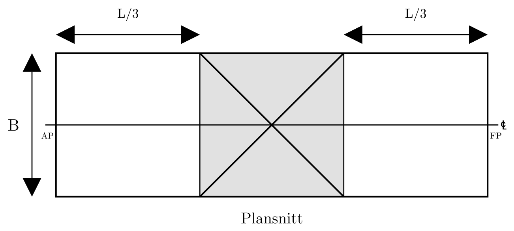
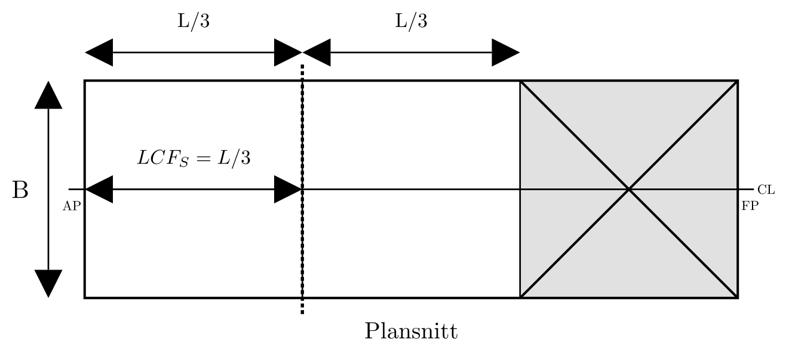

# Damage Stability Module (Lost Buoyancy Method)

## 1. Learning Objectives

By the end of this module, students should be able to:

- Describe the lost buoyancy method assumptions.
- Compute new equilibrium after damage with symmetric flooding.
- Evaluate hydrostatic changes (`KB`, `BM`, `GM`) after damage.
- Compute trim effects for unsymmetric damage and determine `T_A` and `T_F`.
- Verify acceptance criteria: `GM_S > 0 m` and `T_S < D`.

## 2. Assumptions, Symbols, and Units

### 2.1 Assumptions

- Geometry is approximated as prismatic (rectangular barge) unless otherwise stated.
- The damaged compartment is assumed fully open to sea and contributes no buoyancy.
- Floodwater inside the damaged compartment has the same density as outside water (no net weight gain term is added in the lost-buoyancy formulation).
- Static equilibrium is assumed (no dynamic flooding transients).
- Small-angle trim assumptions are used for linear trim relations.
- Sign convention used in this note:
  - Positive draft change means deeper immersion.
  - Positive trim means bow down when $T_F > T_A$.
  - Longitudinal positions are measured from AP (aft perpendicular), with $x=0$ at AP and $x=L$ at FP.

### 2.2 Symbols

| Symbol | Meaning | Unit |
|---|---|---|
| $L$ | Length | m |
| $B$ | Breadth | m |
| $D$ | Depth | m |
| $T$ | Intact draft | m |
| $T_S$ | Damaged symmetric draft | m |
| $\nabla$ | Intact displacement volume | m³ |
| $\nabla_S$ | Damaged displacement volume | m³ |
| $I_{WL}$ | Transverse waterplane second moment (intact) | m⁴ |
| $I_{WL_S}$ | Transverse waterplane second moment (damaged waterplane) | m⁴ |
| $I_F$ | Longitudinal flotation-plane second moment (intact) | m⁴ |
| $I_{F_S}$ | Longitudinal flotation-plane second moment (damaged waterplane) | m⁴ |
| $KB$ | Keel to buoyancy center | m |
| $BM$ | Metacentric radius | m |
| $GM$ | Metacentric height | m |
| $LCB$ | Longitudinal center of buoyancy | m |
| $LCF$ | Longitudinal center of flotation | m |
| $t_a$ | Aft trim component | m |
| $t_f$ | Forward trim component | m |
| $T_A$ | Final aft draft | m |
| $T_F$ | Final forward draft | m |

## 3. Sequential Method (Aligned with Scene Flow)

### 3.1 Baseline Geometry and Hydrostatics Recap

*Animation: Build-up of barge principal dimensions.*

Inputs:

- Main particulars: $L$, $B$, $D$
- Intact condition: $T$, $KG$
- Water density $\rho$

*Animation: Intact hydrostatics — displacement volume and metacentric radii.*

Equations:

- Initial displacement volume:

$$
\nabla = L \times B \times T
$$

- Initial displacement mass:

$$
\Delta = \rho \times \nabla
$$

- Hydrostatic radii form (used later after each update):

$$
BM_T = \frac{I_{WL}}{\nabla},\qquad BM_L = \frac{I_F}{\nabla}
$$

Procedure:

1. Compute intact displacement volume $\nabla$.
2. Compute intact displacement $\Delta$.
3. Record these as the baseline for damage comparison.

Mini-check:

- If $L=60\ \mathrm{m}$, $B=12\ \mathrm{m}$, $T=3.0\ \mathrm{m}$, then $\nabla=2160\ \mathrm{m^3}$.

### 3.2 Damage Setup and Symmetric Flooding

Inputs:

- Damaged compartment length $l_d$
- Compartment location along the vessel
- Flooding mode (this section: symmetric flooding)

Equations:

- Effective buoyant length for one fully damaged longitudinal compartment:

$$
L_S = L-l_d
$$

- Symmetric equilibrium relation (pre-trim):

$$
L \times B \times T = L_S \times B \times T_S
$$

Procedure:

1. Define the damaged compartment geometry.
2. Compute $L_S$.
3. Write the symmetric equilibrium equation to be solved in Section 3.3.

Mini-check:

- With $L=60\ \mathrm{m}$ and $l_d=3.5\ \mathrm{m}$, $L_S=56.5\ \mathrm{m}$.

### 3.3 Parallel Submergence and New Displacement

*Animation: Parallel sinkage to the symmetric damage draft $T_S$.*

This phase establishes the new symmetric damage draft before trim effects are added.

Required inputs:

- Intact draft $T$
- Barge length $L$ and breadth $B$
- Damaged compartment length $l_d$

For a rectangular barge with one fully flooded longitudinal compartment, the effective buoyant length becomes $(L-l_d)$. Conservation of displacement volume gives:

$$
L \times B \times T = (L-l_d) \times B \times T_S
$$

Solve directly for damaged symmetric draft:

$$
T_S = \frac{L}{L-l_d}T
$$

Then enforce displacement conservation in the damaged equilibrium state:

$$
\nabla_S = \nabla
$$

Use this sequence every time:

1. Solve for $T_S$ from compartment length.
2. Set $\nabla_S=\nabla$ (displacement unchanged after flooding in this model).
3. Set $\Delta_S=\Delta$ (same reason).
4. Continue with hydrostatics and trim.

Why this order matters:

- In the lost-buoyancy equilibrium used in the scenes, flooding removes buoyancy from one region while the vessel sinks until total buoyancy again equals vessel weight.
- That means displacement is conserved: $\nabla_S=\nabla$.

Mini-example: barge with 3 equal compartments (center compartment damaged)

- Given: $L=60\ \mathrm{m}$, $B=12\ \mathrm{m}$, $T=3.00\ \mathrm{m}$, 3 equal compartments
- Damaged compartment length: $l_d=L/3=20\ \mathrm{m}$

$$
T_S = \frac{L}{L-l_d}T = \frac{60}{60-20}\cdot 3.00 = 4.50\ \mathrm{m}
$$

$$
\nabla_S = \nabla = L \times B \times T = 60\cdot 12\cdot 3.00 = 2160\ \mathrm{m^3}
$$

Checks:

- $T_S > T$ (as expected after damage).
- Draft criterion in this example is satisfied if $D > 4.50\ \mathrm{m}$.

### 3.4 Updated Hydrostatics After Damage (`KB`, `BM`, `GM`)

Inputs:

- Damaged draft estimate $T_S$ (or final trimmed drafts in iteration)
- Damaged-condition hydrostatic inputs: $KB_S$, $I_{WL_S}$, $I_{F_S}$
- Vertical center of gravity $KG$

#### 3.4.1 Vertical shift of bouyancy $KB$ 

*Animation: Vertical shift of the centre of buoyancy — $KB_S$ after damage.*

Equations: 
TODO add equation as given in scene for BargeDamageKB

*Animation: Reduction of transverse metacentric radius $BM_{T_S}$ due to lost waterplane area.*

#### 3.4.1 Reduction of waterplanearea, $ A_WL $ 

Equations:

- Damaged hydrostatic radii:

*Figure: Reduction in transverse metacentric radius after damage.*

$$
BM_{T_S} = \frac{I_{WL_S}}{\nabla},\qquad BM_{L_S} = \frac{I_{F_S}}{\nabla}
$$

#### 3.4.3 Residual transverse metacentric height $GM_S$

Procedure:

1. Set $\nabla_S=\nabla$ from Section 3.3.
2. Compute $KB_S$
3. Compute $A_WL_S$
4. Compute $BM_{T_S}$ 
5. Compute $GM_S$.

Equations:

$$
GM_S = KB_S + BM_{T_S} - KG
$$

Mini-check:

- If $KB_S=1.62\ \mathrm{m}$, $I_{WL_S}=7600\ \mathrm{m^4}$, $\nabla=2160\ \mathrm{m^3}$, $KG=4.20\ \mathrm{m}$, then $GM_S=0.939\ \mathrm{m}$.

### 3.5 Unsymmetric Damage: $LCB$, $LCF$ and $BM_L$

*Animation: Longitudinal geometry after unsymmetric damage — $LCB_S$, $LCF_S$, and $BM_{L_S}$.*

Inputs:

- Displacement $\Delta$ (unchanged in this model)
- AP-referenced longitudinal coordinates: $LCG$, $LCB_S$, $LCF_S$
- Longitudinal inertia $I_{F_S}$ and displacement volume $\nabla$

Equations:

*Figure: Unsymmetric damage geometry showing longitudinal BM context and damaged-state LCF.*

- Longitudinal metacentric radius:

$$
BM_{L_S} = \frac{I_{F_S}}{\nabla}
$$

- Trim arm: 

$$
l_k = LCG-LCB_S
$$

- Trim moment:

$$
M_{T} = \Delta \times l_k
$$

- Moment to change trim 1 cm (box-barge approximation):

$$
MCT_{1cm_S} = \frac{\Delta \times BM_{L_S}}{100 \times L}
$$

Procedure:

1. Determine $LCB_S$ from damaged buoyancy geometry.
2. Determine $LCF_S$ from damaged waterplane geometry.
3. Compute $BM_{L_S}$.
4. Compute $M_{trim}$ as input to Section 3.6.

Mini-check:

- If $\Delta=2160\ \mathrm{t}$, $LCB_S=29.75\ \mathrm{m}$ from AP, and $LCG=30.00\ \mathrm{m}$ from AP, then $M_{trim}=540.0\ \mathrm{t\,m}$.

### 3.6 Trimming Moment and Trim Distribution ($t_a$, $t_f$, $T_A$, $T_F$)

*Animation: Trim moment calculation and distribution into trim components $t_a$ (aft) and $t_f$ (forward).*

This phase converts the trimming moment into forward and aft drafts.

Required inputs:

- Displacement $\Delta$ (unchanged in this model)
- Longitudinal positions $LCG$, $LCB_S$, and $LCF_S$ (measured from AP)
- Longitudinal metacentric radius $BM_{L_S}$ and vessel length $L$
- Symmetric damaged draft $T_S$

Step-by-step procedure:

*Figure: Trim setup and sign convention for aft and forward draft changes.*

1. Compute lever arm

$$
l_k= LCG-LCB_S
$$

2. Compute trim moment:

$$
M_{T}=\Delta \times l_k
$$

2. Compute moment to change trim by 1 cm:

$$
MCT_{1cm_S}=\frac{\Delta \times BM_{L_S}}{100 \times L}
$$

3. Compute total trim change:

$$
t_{cm} = \frac{M_{T}}{MCT_{1cm_S}}
$$

4. Convert to meters: $t_m=t_{cm}/100$.

5. Distribute $t_m$ around $LCF_S$ into trim components $t_a$ (aft) and $t_f$ (forward) using AP/FP weighting factors.

General AP-based distribution factors:

$$
	aft =\frac{LCF_S}{L},
\qquad
	fore =\frac{L-LCF_S}{L}
$$

*Figure: Distribution of total trim between aft and forward drafts about $LCF_S$.*

Then compute trim components $t_a$ and $t_f$:

$$
t_a = t_m\left(\frac{LCF_S}{L}\right),
\qquad
t_f = t_m\left(\frac{L-LCF_S}{L}\right)
$$

Special case (if $LCF_S=L/2$, i.e., midship):

$$
t_a = \frac{t_m}{2},\qquad t_f = \frac{t_m}{2}
$$

6. Apply trim components to $T_S$ to get final drafts:
NOTE: If trim moment is counterclockwise, the signs in the equations below reverse.
$$
T_A= T_S - t_a,\qquad T_F= T_S + t_f
$$

Mini example:

- If $trim=1.543\ \mathrm{cm}$, then $trim_m=0.01543\ \mathrm{m}$.
- If $LCF_S=L/2$, trim components are $t_a = t_f = 0.00771\ \mathrm{m}$.

### 3.7 Final Equilibrium and Acceptance Check

Inputs:

- Final drafts $T_A$, $T_F$
- Residual metacentric height $GM_S$
- Vessel depth $D$

Equations:

$$
GM_S > 0\ \mathrm{m}
$$

- Critical draft criterion:

$$
T_{crit}=\max(T_A,T_F) < D
$$

Procedure:

1. Collect final damaged state ($T_S$, $T_A$, $T_F$, $GM_S$).
2. Check residual stability ($GM_S>0$).
3. Check immersion limit using $T_{crit}$.
4. Classify the case as pass/fail.

Mini-check:

- If both criteria pass, the simplified damaged condition is acceptable.
- If either criterion fails, revise loading, subdivision, or allowable damage assumptions.

## 4. Full Worked Example (End-to-End)

### 4.1 Given Data

- Vessel (rectangular barge):
  - $L = 60.0\ \mathrm{m}$
  - $B = 12.0\ \mathrm{m}$
  - $D = 6.0\ \mathrm{m}$
  - Initial mean draft $T = 3.00\ \mathrm{m}$
  - Vertical center of gravity $KG = 4.20\ \mathrm{m}$
  - Seawater density approximation: $\rho = 1.0\ \mathrm{t/m^3}$
- Damage case:
  - Damaged compartment length $l_d = 3.5\ \mathrm{m}$
  - Longitudinal buoyancy center after damage: $LCB_S = 29.75\ \mathrm{m}$ from AP
  - Longitudinal flotation center after damage: $LCF_S = 30.00\ \mathrm{m}$ from AP
- Updated hydrostatic inputs from geometry model after damage:
  - $KB_S = 1.62\ \mathrm{m}$
  - $I_{WL_S} = 7600\ \mathrm{m^4}$
  - $I_{F_S} = 2.10 \times 10^6\ \mathrm{m^4}$

### 4.2 Solution Steps

Step 1: Initial displacement and setup

$$
\nabla = L \times B \times T = 60 \cdot 12 \cdot 3.00 = 2160\ \mathrm{m^3}
$$

With $\rho = 1.0\ \mathrm{t/m^3}$, initial displacement is $\Delta = 2160\ \mathrm{t}$.

Step 2: Parallel submergence solved from compartment length

For a rectangular barge with one fully damaged longitudinal compartment, the damaged buoyant length is $(L-l_d)$. Equilibrium gives:

$$
L \times B \times T = (L-l_d) \times B \times T_S
$$

$$
T_S = \frac{L}{L-l_d}T = \frac{60}{60-3.5}\cdot 3.00 = 3.1858\ \mathrm{m}
$$

Apply displacement conservation for this lost-buoyancy setup:

$$
\nabla_S = \nabla = 2160\ \mathrm{m^3}
$$

So displacement remains:

$$
\Delta_S = \Delta = 2160\ \mathrm{t}
$$

Step 3: Updated hydrostatics ($BM_{T_S}$, $BM_{L_S}$, $GM_S$)

$$
BM_{T_S} = \frac{I_{WL_S}}{\nabla} = \frac{7600}{2160} = 3.519\ \mathrm{m}
$$

$$
BM_{L_S} = \frac{I_{F_S}}{\nabla} = \frac{2.10 \times 10^6}{2160} = 972.2\ \mathrm{m}
$$

$$
GM_S = KB_S + BM_{T_S} - KG = 1.62 + 3.519 - 4.20 = 0.939\ \mathrm{m}
$$

Step 4: Trim and final drafts

Using AP-based coordinates, take $LCG = 30.00\ \mathrm{m}$ and $LCB_S = 29.75\ \mathrm{m}$:

$$
M_{trim} = \Delta \times (LCG - LCB_S) = 2160\,(30.00 - 29.75) = 540.0\ \mathrm{t\,m}
$$

Use a box-barge approximation for moment-to-change-trim 1 cm:

$$
MCT_{1cm_S} = \frac{\Delta \times BM_{L_S}}{100 \times L} = \frac{2160 \cdot 972.2}{100 \cdot 60} = 350.0\ \mathrm{t\,m/cm}
$$

$$
trim = \frac{M_{trim}}{MCT_{1cm_S}} = \frac{540.0}{350.0} = 1.543\ \mathrm{cm} = 0.01543\ \mathrm{m}
$$

Assume trim about $LCF_S = 30.00\ \mathrm{m}$ from AP (midship in this case), so trim components $t_a$ and $t_f$ are each half the total trim:

$$
t_a = \frac{trim_m}{2} = 0.00771\ \mathrm{m},\qquad t_f = \frac{trim_m}{2} = 0.00771\ \mathrm{m}
$$

Final drafts:

$$
T_F = T_S + t_f = 3.1858 + 0.00771 = 3.1935\ \mathrm{m}
$$

$$
T_A = T_S - t_a = 3.1858 - 0.00771 = 3.1781\ \mathrm{m}
$$

Step 5: Acceptance checks

- Residual stability:

$$
GM_S = 0.939\ \mathrm{m} > 0\ \mathrm{m}\ \checkmark
$$

- Draft/depth check (use max draft in this simple case):

$$
T_{S,\max} \approx T_F = 3.1935\ \mathrm{m} < D = 6.0\ \mathrm{m}\ \checkmark
$$

### 4.3 Final Results

| Quantity | Value | Unit |
|---|---:|---|
| Initial displacement volume $\nabla$ | 2160 | m^3 |
| Damaged compartment length $l_d$ | 3.5 | m |
| Solved symmetric draft $T_S$ | 3.1858 | m |
| Damaged displacement volume $\nabla_S$ | 2160 | m^3 |
| $BM_{T_S}$ | 3.519 | m |
| $GM_S$ | 0.939 | m |
| Total trim | 0.0154 | m |
| Final aft draft $T_A$ | 3.1781 | m |
| Final forward draft $T_F$ | 3.1935 | m |
| Acceptance status | PASS | - |

Note:
- This worked example is intentionally simple and uses box-barge approximations for teaching flow.
- In production calculations, replace simplified terms with your hydrostatic model outputs for each intermediate draft.

### 4.4 Additional Full Worked Example: 5 Equal Compartments, Compartment 4 Damaged

Given:

- Barge dimensions: $L=100.0\ \mathrm{m}$, $B=20.0\ \mathrm{m}$, $D=12.0\ \mathrm{m}$
- Initial draft: $T=3.50\ \mathrm{m}$
- 5 equal longitudinal compartments, so each compartment length is $L/5=20.0\ \mathrm{m}$
- Damaged compartment: No. 4 (from AP), spanning $x=60$ to $x=80\ \mathrm{m}$
- For this worked example, use $\rho=1.025\ \mathrm{t/m^3}$ (seawater) and assume $LCG=50.0\ \mathrm{m}$ (midship)
- Box-barge vertical approximation at damaged equilibrium: $KB_S \approx T_S/2$

*Figure: Five equal longitudinal watertight compartments, with one damaged compartment in the worked example.*

Step 1: Initial displacement

$$
\nabla = L \times B \times T = 100 \cdot 20 \cdot 3.50 = 7000\ \mathrm{m^3}
$$

$$
\Delta = \rho \times \nabla = 1.025\times 7000 = 7175\ \mathrm{t}
$$

Step 2: Symmetric damaged draft from lost buoyant length

Damaged compartment length:

$$
l_d = 20.0\ \mathrm{m},\qquad L_S=L-l_d=80.0\ \mathrm{m}
$$

Solve equilibrium:

$$
L \times B \times T = (L-l_d) \times B \times T_S
$$

$$
T_S = \frac{L}{L-l_d}T = \frac{100}{80}\cdot 3.50 = 4.375\ \mathrm{m}
$$

Displacement conservation:

$$
\nabla_S = \nabla = 7000\ \mathrm{m^3},\qquad \Delta_S = \Delta = 7175\ \mathrm{t}
$$

Step 3: Damaged hydrostatic inputs from compartment geometry

Surviving buoyant/waterplane regions are intervals $[0,60]$ and $[80,100]$ m from AP.

Longitudinal centroids:

$$
LCB_S = LCF_S = \frac{60\cdot 30 + 20\cdot 90}{60+20} = 45.0\ \mathrm{m}
$$

Damaged transverse waterplane second moment:

$$
I_{WL_S}=\frac{1}{12}(80)B^3 = \frac{1}{12}(80)(20^3)=53{,}333.3\ \mathrm{m^4}
$$

Damaged longitudinal flotation second moment about $LCF_S$:

$$
I_{F_S}=\left[\frac{B\,60^3}{12}+A_1(30-45)^2\right]+\left[\frac{B\,20^3}{12}+A_2(90-45)^2\right]
$$

with $A_1=60\cdot 20=1200\ \mathrm{m^2}$ and $A_2=20\cdot 20=400\ \mathrm{m^2}$, giving

$$
I_{F_S}=1{,}453{,}333.3\ \mathrm{m^4}
$$

Use $KB_S \approx T_S/2 = 2.1875\ \mathrm{m}$.

Step 4: Updated stability quantities

$$
BM_{T_S}=\frac{I_{WL_S}}{\nabla}=\frac{53{,}333.3}{7000}=7.619\ \mathrm{m}
$$

$$
BM_{L_S}=\frac{I_{F_S}}{\nabla}=\frac{1{,}453{,}333.3}{7000}=207.619\ \mathrm{m}
$$

$$
GM_S=KB_S+BM_{T_S}-KG=2.1875+7.619-4.20=5.607\ \mathrm{m}
$$

Step 5: Trim and final drafts

$$
M_{trim}=\Delta \times (LCG-LCB_S)=7175\times(50.0-45.0)=35{,}875\ \mathrm{t\,m}
$$

$$
MCT_{1cm_S}=\frac{\Delta \times BM_{L_S}}{100\times L}=\frac{7175\times 207.619}{100\times 100}=148.967\ \mathrm{t\,m/cm}
$$

$$
trim_{cm}=\frac{M_{trim}}{MCT_{1cm_S}}=240.83\ \mathrm{cm},\qquad trim_m=2.4083\ \mathrm{m}
$$

Compute trim components $t_a$ and $t_f$ using AP-based distribution factors ($LCF_S=45.0\ \mathrm{m}$):

$$
	ext{aft share}=\frac{LCF_S}{L}=0.45,\qquad \text{forward share}=\frac{L-LCF_S}{L}=0.55
$$

$$
t_a=trim_m\left(\frac{LCF_S}{L}\right)=2.4083\times 0.45=1.084\ \mathrm{m}
$$

$$
t_f=trim_m\left(\frac{L-LCF_S}{L}\right)=2.4083\times 0.55=1.3246\ \mathrm{m}
$$

Final drafts:

$$
T_A=T_S-t_a=4.375-1.084=3.291\ \mathrm{m}
$$

$$
T_F=T_S+t_f=4.375+1.3246=5.700\ \mathrm{m}
$$

Step 6: Acceptance checks

$$
GM_S=5.607\ \mathrm{m}>0\ \mathrm{m}\ \checkmark
$$

$$
T_{crit}=\max(T_A,T_F)=5.700\ \mathrm{m}<D=12.0\ \mathrm{m}\ \checkmark
$$

### 4.5 Final Results (Additional Example)

| Quantity | Value | Unit |
|---|---:|---|
| Initial displacement volume $\nabla$ | 7000 | m^3 |
| Damaged compartment length $l_d$ | 20.0 | m |
| Solved symmetric draft $T_S$ | 4.375 | m |
| $LCB_S=LCF_S$ | 45.0 | m from AP |
| $I_{WL_S}$ | 53,333.3 | m^4 |
| $I_{F_S}$ | 1,453,333.3 | m^4 |
| $BM_{T_S}$ | 7.619 | m |
| $GM_S$ | 5.607 | m |
| Total trim | 2.408 | m |
| Final aft draft $T_A$ | 3.291 | m |
| Final forward draft $T_F$ | 5.700 | m |
| Acceptance status | PASS | - |

## 5. Common Mistakes and Sanity Checks

- Unit mismatch between $\mathrm{m}$, $\mathrm{m^2}$, $\mathrm{m^3}$, and tonnes.
- Treating displacement as changed after flooding in this model ($\nabla_S\neq\nabla$).
- Mixing transverse and longitudinal inertias ($I_{WL_S}$ vs $I_{F_S}$).
- Using opposite trim sign convention mid-calculation.
- Forgetting that acceptance uses the critical draft $\max(T_A,T_F)$.

Quick sanity checks:

- $T_S$ should normally be greater than $T$.
- Check that displacement is conserved in the setup: $\nabla_S=\nabla$ and $\Delta_S=\Delta$.
- $GM_S$ should decrease relative to intact condition in most damage cases.

## 6. Quick Reference Algorithm

1. Gather inputs: $L$, $B$, $D$, $T$, $KG$, $l_d$, $I_{WL_S}$, $I_{F_S}$, $KB_S$, $LCB_S$, $LCF_S$.
2. Solve symmetric damaged draft:

$$
T_S = \frac{L}{L-l_d}T
$$

3. Set damaged equilibrium displacement state:

$$
\nabla_S=\nabla,\quad \Delta_S=\Delta
$$

4. Compute hydrostatics:

$$
BM_{T_S}=\frac{I_{WL_S}}{\nabla},\quad BM_{L_S}=\frac{I_{F_S}}{\nabla},\quad GM_S=KB_S+BM_{T_S}-KG
$$

5. Compute trim:

$$
M_{trim}=\Delta \times (LCG-LCB_S),\quad MCT_{1cm_S}=\frac{\Delta \times BM_{L_S}}{100 \times L},\quad trim_{cm}=\frac{M_{trim}}{MCT_{1cm_S}}
$$

6. Distribute trim to get $T_A$ and $T_F$.
7. Acceptance checks: $GM_S>0$ and $\max(T_A,T_F)<D$.

## 7. References and Figure Placeholders

Suggested references:

- Class notes on hydrostatics and damage stability.
- Standard naval architecture texts for lost buoyancy and trim.

Figure placeholders (existing exports):

- Symmetric damage equilibrium figure.
- Reduction in transverse $BM$ figure.
- Longitudinal $BM$ and $LCF$ shift figure.
- Trim setup and trim distribution figure.
