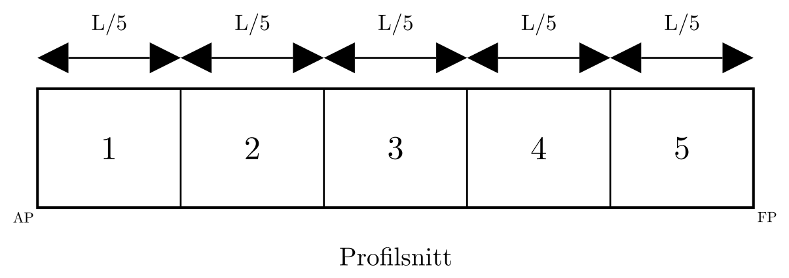

# Damage Stability Exercises (Lost Buoyancy Method)

## 1. How to Use

- Solve each task with clear units and sign conventions.
- Show intermediate steps, not only final numbers.
- Verify final acceptance criteria when requested.
- For damage-length tasks, solve $T_S$ from
  $LBT = (L-l_d)BT_S$ and keep displacement conserved in this model ($\nabla_S=\nabla$).

## 2. Exercise Set A: Single-Concept Drills

### A1. Symmetric Flooding Equilibrium

**Download Exercise Notebook:** [Oppgave_A1.ipynb](../../exports/Oppgave_A1.ipynb)

- Task:
  - Compute new equilibrium draft under symmetric flooding.
- Given:
  - Rectangular barge with $L = 50.0\ \mathrm{m}$, $B = 10.0\ \mathrm{m}$, $D = 5.0\ \mathrm{m}$
  - Initial draft $T = 2.80\ \mathrm{m}$
  - Damaged compartment length: $l_d = 2.0\ \mathrm{m}$
  - Assume full-loss compartment behavior and parallel sinkage for this drill
- Deliverables:
  - Final draft
  - Short method
- Final answer:
  - $T_S = 2.9167\ \mathrm{m}$

### A2. Three-Compartment Drill (Center Compartment Damaged)

**Download Exercise Notebook:** [Oppgave_A2.ipynb](../../exports/Oppgave_A2.ipynb)

- Task:
  - A barge is divided into 3 equal longitudinal compartments. The center compartment is damaged and fully flooded.
  - Solve for $T_S$ first from compartment length.
- Given:
  - Rectangular barge with $L = 60.0\ \mathrm{m}$, $B = 12.0\ \mathrm{m}$, $D = 6.0\ \mathrm{m}$
  - Initial draft $T = 3.00\ \mathrm{m}$
  - 3 equal compartments, so $l_d = L/3$
- Deliverables:
  - Damaged compartment length $l_d$
  - Symmetric damaged draft $T_S$
  - Check whether $T_S < D$
- Final answer:
  - Use the hidden solution below for self-check

### A3. Waterplane Inertia Reduction and $BM$

**Download Exercise Notebook:** [Oppgave_A3.ipynb](../../exports/Oppgave_A3.ipynb)

- Task:
  - Calculate reduced waterplane area after damage.
  - Determine reduced waterplane inertia and updated $BM_{T_S}$.
- Given:
  - Rectangular barge with $L=72.0\ \mathrm{m}$, $B=11.0\ \mathrm{m}$, $T=2.80\ \mathrm{m}$
  - Damaged compartment length $l_d=6.0\ \mathrm{m}$
  - Conserved displacement volume in this model: $\nabla=LBT=2217.6\ \mathrm{m^3}$
  - For this drill, use box-waterplane formulas for both intact and damaged states
- Deliverables:
  - Waterplane area before/after
  - $I_{WL}$ before/after
  - $BM_T$ before/after
- Final answer:
  - Fill in

### A4. Vertical Hydrostatics Update ($KB$, $GM$)

**Download Exercise Notebook:** [Oppgave_A4.ipynb](../../exports/Oppgave_A4.ipynb)

- Task:
  - Compute updated $KB_S$, $BM_{T_S}$, and $GM_S$ in damaged condition.
- Given:
  - Damaged-condition center of buoyancy: $KB_S=1.62\ \mathrm{m}$
  - Damaged transverse waterplane second moment: $I_{WL_S}=7600\ \mathrm{m^4}$
  - Conserved displacement volume: $\nabla=2160\ \mathrm{m^3}$
  - Vertical center of gravity: $KG=4.20\ \mathrm{m}$
- Deliverables:
  - Updated hydrostatic values
  - Stability interpretation
- Final answer:
  - Fill in

## 3. Exercise Set B: Parameter Variation

### B1. Sensitivity Study

**Download Exercise Notebook:** [Oppgave_B1.ipynb](../../exports/Oppgave_B1.ipynb)

- Task:
  - Use the table below.
  - For each case, compute $l_d=L/N$, then calculate $T_S$, $BM_{T_S}$, and $GM_S$.
  - Compare how the input changes affect $T_S$ and $GM_S$.
- Given:
  - Use $KG=4.20\ \mathrm{m}$ and $\rho=1.0\ \mathrm{t/m^3}$ for all cases.
  - Assume one damaged compartment and use box-barge approximations.

| Case | $L$ (m) | $B$ (m) | $T$ (m) | $N$ compartments | $l_d=L/N$ (m) | $T_S$ (m) | $BM_{T_S}$ (m) | $GM_S$ (m) |
|---|---:|---:|---:|---:|---:|---:|---:|---:|
| Base | 60.0 | 12.0 | 3.00 | 5 |  |  |  |  |
| Fewer compartments | 60.0 | 12.0 | 3.00 | 3 |  |  |  |  |
| Wider barge | 60.0 | 14.0 | 3.00 | 5 |  |  |  |  |
| Higher initial draft | 60.0 | 12.0 | 3.50 | 5 |  |  |  |  |

- Deliverables:
  - Completed table (all blank cells filled)
  - Short trend discussion
- Final answer:
  - Fill in

## 4. Exercise Set C: Trim Concepts

### C1. Trimming Moment Due to Flooded Compartment

**Download Exercise Notebook:** [Oppgave_C1.ipynb](../../exports/Oppgave_C1.ipynb)



*Figure: Five equal compartments; use this layout for flooded-compartment trim-moment setup.*

- Task:
  - Determine trimming moment caused by flooding of compartment 4 (from AP) using AP-based coordinates.
- Given:
  - Rectangular barge with $L=100.0\ \mathrm{m}$, $B=20.0\ \mathrm{m}$, $T=3.50\ \mathrm{m}$
  - 5 equal longitudinal compartments, so each compartment length is $20.0\ \mathrm{m}$
  - Compartment 4 damaged (spanning $x=60$ to $x=80\ \mathrm{m}$)
  - Use $\rho=1.025\ \mathrm{t/m^3}$ and $LCG=50.0\ \mathrm{m}$ from AP
  - For this drill, use $LCB_S=45.0\ \mathrm{m}$ from AP
- Deliverables:
  - Initial displacement mass $\Delta$
  - Lever arm $l_k=LCG-LCB_S$
  - Trimming moment $M_{trim}=\Delta\,l_k$
- Final answer:
  - Fill in

### C2. Trim from Given $M_{trim}$ and $BM_{L_S}$

**Download Exercise Notebook:** [Oppgave_C2.ipynb](../../exports/Oppgave_C2.ipynb)

- Task:
  - Calculate $MCT_{1cm_S}$ and total trim.
- Given:
  - $\Delta=7175\ \mathrm{t}$
  - $L=100.0\ \mathrm{m}$
  - $BM_{L_S}=207.619\ \mathrm{m}$
  - $M_{trim}=35{,}875\ \mathrm{t\,m}$
- Deliverables:
  - $MCT_{1cm_S}$ in $\mathrm{t\,m/cm}$
  - $trim_{cm}$ and $trim_m$
- Final answer:
  - Fill in

### C3. Distribution of Trim About $LCF_S$

**Download Exercise Notebook:** [Oppgave_C3.ipynb](../../exports/Oppgave_C3.ipynb)

- Task:
  - Distribute known trim to aft and forward components and compute final drafts.
- Given:
  - $trim_m=2.4083\ \mathrm{m}$
  - $LCF_S=45.0\ \mathrm{m}$ from AP, $L=100.0\ \mathrm{m}$
  - Symmetric damaged draft before trim: $T_S=4.375\ \mathrm{m}$
- Deliverables:
  - $t_a$ and $t_f$
  - Final drafts $T_A$ and $T_F$
  - Critical draft $T_{crit}=\max(T_A,T_F)$
- Final answer:
  - Fill in

## 5. Exercise Set D: Full Combined Problem

### D1. End-to-End Damage Equilibrium

**Download Exercise Notebook:** [Oppgave_D1.ipynb](../../exports/Oppgave_D1.ipynb)

- Task:
  - Solve full method from initial condition to final acceptance check.
- Given:
  - Rectangular barge: $L = 60.0\ \mathrm{m}$, $B = 12.0\ \mathrm{m}$, $D = 6.0\ \mathrm{m}$
  - Initial draft: $T = 3.00\ \mathrm{m}$
  - Center of gravity: $KG = 4.20\ \mathrm{m}$
  - Damaged compartment length: $l_d = 3.5\ \mathrm{m}$
  - Updated hydrostatic model outputs at damaged condition:
    - $KB_S = 1.62\ \mathrm{m}$
    - $I_{WL_S} = 7600\ \mathrm{m^4}$
    - $I_{F_S} = 2.10 \times 10^6\ \mathrm{m^4}$
    - $LCB_S = 29.75\ \mathrm{m}$ from AP
    - $LCF_S = 30.00\ \mathrm{m}$ from AP
  - Use $\rho = 1.0\ \mathrm{t/m^3}$
- Required steps:
  - Setup and assumptions
  - Parallel submergence
  - Updated hydrostatics
  - Trim: compute components $t_a$ and $t_f$, then determine $T_A$ and $T_F$
  - Acceptance checks ($GM_S > 0\ \mathrm{m}$, $\max(T_A,T_F) < D$)
- Final answer:
  - $T_S = 3.1858\ \mathrm{m}$, $T_A = 3.1781\ \mathrm{m}$, $T_F = 3.1935\ \mathrm{m}$, $GM_S = 0.939\ \mathrm{m}$, PASS

## 6. Exercise Set E: Concept Comparison

### E1. Slack Tank FSE vs Damaged Flooded Tank (Symmetric Centerline Case)

**Download Exercise Notebook:** [Oppgave_E1.ipynb](../../exports/Oppgave_E1.ipynb)

- Task:
  - A barge has a full-breadth tank of length $l_{tank}$. Compare:
    - Free-surface correction to $GM$ for an intact but slack tank (content density equals seawater)
    - $GM_S$ reduction for the same compartment treated as damaged (lost buoyancy)
- Given:
  - $L = 50.0\ \mathrm{m}$, $B = 10.0\ \mathrm{m}$, $T = 2.80\ \mathrm{m}$
  - $l_{tank} = 5.0\ \mathrm{m}$, $l_d = l_{tank}$
  - Assume $T_S = T$ (parallel sinkage neglected for the comparison)
- Deliverables:
  - Short derivation or argument
  - Quantitative comparison
  - Physical interpretation
- Final answer:
  - $\Delta GM_{FSE} = \Delta BM_T = 0.298\ \mathrm{m}$ - both methods give identical GM reduction

## 7. Solution Section

### A1 Solution

Given:

- $L = 50.0\ \mathrm{m}$
- $B = 10.0\ \mathrm{m}$
- $T = 2.80\ \mathrm{m}$
- $l_d = 2.0\ \mathrm{m}$

Solve directly for damaged equilibrium draft $T_S$:

$$
LBT = (L-l_d)BT_S
$$

$$
T_S = \frac{L}{L-l_d}T = \frac{50}{50-2.0}\cdot 2.80 = 2.9167\ \mathrm{m}
$$

Quick check against depth:

$$
T_S = 2.9167\ \mathrm{m} < D = 5.0\ \mathrm{m}\ \Rightarrow\ \text{draft criterion satisfied}
$$

### A2 Solution

<details>
<summary>Show solution</summary>

Given:

- $L = 60.0\ \mathrm{m}$
- $B = 12.0\ \mathrm{m}$
- $D = 6.0\ \mathrm{m}$
- $T = 3.00\ \mathrm{m}$
- $l_d = L/3 = 20.0\ \mathrm{m}$

Solve for $T_S$:

$$
LBT = (L-l_d)BT_S
$$

$$
T_S = \frac{L}{L-l_d}T = \frac{60}{60-20}\cdot 3.00 = 4.50\ \mathrm{m}
$$

Depth check:

$$
T_S = 4.50\ \mathrm{m} < D = 6.0\ \mathrm{m}\ \Rightarrow\ \text{draft criterion satisfied}
$$

</details>

### A3 Solution

Use the A2 input set:

- $L=72.0\ \mathrm{m}$, $B=11.0\ \mathrm{m}$, $T=2.80\ \mathrm{m}$
- $l_d=6.0\ \mathrm{m}$
- $\nabla=LBT=72\cdot 11\cdot 2.8=2217.6\ \mathrm{m^3}$

Waterplane area before and after damage:

$$
A_{WL}=LB=72\cdot 11=792\ \mathrm{m^2}
$$

$$
A_{WL_S}=(L-l_d)B=(72-6)\cdot 11=726\ \mathrm{m^2}
$$

$$
\Delta A_{WL}=792-726=66\ \mathrm{m^2}
$$

Intact transverse waterplane inertia for a box waterplane:

$$
I_{WL}=\frac{LB^3}{12}=\frac{72\cdot 11^3}{12}=7986.0\ \mathrm{m^4}
$$

Damaged transverse waterplane inertia:

$$
I_{WL_S}=\frac{(L-l_d)B^3}{12}=\frac{66\cdot 11^3}{12}=7320.5\ \mathrm{m^4}
$$

Intact and damaged transverse metacentric radii:

$$
BM_T=\frac{I_{WL}}{\nabla}=\frac{7986.0}{2217.6}=3.601\ \mathrm{m}
$$

$$
BM_{T_S}=\frac{I_{WL_S}}{\nabla}=\frac{7320.5}{2217.6}=3.301\ \mathrm{m}
$$

Reduction:

$$
\Delta I_{WL}=7986.0-7320.5=665.5\ \mathrm{m^4}
$$

$$
\Delta BM_T=3.601-3.301=0.300\ \mathrm{m}
$$

Final answer:

- Waterplane area before/after: $792\ \rightarrow\ 726\ \mathrm{m^2}$
- $I_{WL}$ before/after: $7986.0\ \rightarrow\ 7320.5\ \mathrm{m^4}$
- $BM_T$ before/after: $3.601\ \rightarrow\ 3.301\ \mathrm{m}$
- Interpretation: damaged waterplane has lower inertia, so $BM_T$ decreases.

### A4 Solution

Use the D1 damaged-condition inputs:

- $KB_S=1.62\ \mathrm{m}$
- $I_{WL_S}=7600\ \mathrm{m^4}$
- $\nabla=2160\ \mathrm{m^3}$
- $KG=4.20\ \mathrm{m}$

Compute damaged transverse metacentric radius:

$$
BM_{T_S}=\frac{I_{WL_S}}{\nabla}=\frac{7600}{2160}=3.519\ \mathrm{m}
$$

Then compute damaged metacentric height:

$$
GM_S=KB_S+BM_{T_S}-KG=1.62+3.519-4.20=0.939\ \mathrm{m}
$$

Final answer:

- $KB_S=1.62\ \mathrm{m}$
- $BM_{T_S}=3.519\ \mathrm{m}$
- $GM_S=0.939\ \mathrm{m}$
- Stability interpretation: $GM_S>0$, so residual initial transverse stability remains positive.

### B1 Solution

Assumptions for a quick sensitivity sweep:

- One compartment damaged, with equal-length compartments: $l_d=L/N$
- Symmetric draft only (no trim in this drill):
  $$T_S=\frac{L}{L-l_d}T$$
- Box-barge vertical approximation: $KB_S\approx T_S/2$
- Damaged transverse inertia approximation: $I_{WL_S}\approx (L-l_d)B^3/12$
- Conserved displacement volume in this model: $\nabla=LBT$
- Compare $GM_S$ with constant $KG=4.20\ \mathrm{m}$:
  $$BM_{T_S}=\frac{I_{WL_S}}{\nabla},\qquad GM_S\approx KB_S+BM_{T_S}-KG$$

Example comparison:

| Case | $L$ (m) | $B$ (m) | $T$ (m) | $N$ | $l_d$ (m) | $T_S$ (m) | $BM_{T_S}$ (m) | $GM_S$ (m) |
|---|---:|---:|---:|---:|---:|---:|---:|---:|
| Base | 60 | 12 | 3.0 | 5 | 12.0 | 3.750 | 3.200 | 0.875 |
| Fewer compartments (larger damage length) | 60 | 12 | 3.0 | 3 | 20.0 | 4.500 | 2.667 | 0.717 |
| Wider barge | 60 | 14 | 3.0 | 5 | 12.0 | 3.750 | 4.356 | 2.031 |
| Higher intact draft | 60 | 12 | 3.5 | 5 | 12.0 | 4.375 | 2.743 | 0.731 |

Trend summary:

- Larger damage length ($N$ smaller) increases $T_S$ and tends to reduce $GM_S$.
- Increasing breadth strongly increases $I_{WL_S}$ and $BM_{T_S}$, so $GM_S$ improves.
- Increasing intact draft raises $KB_S$ but also increases displacement; in this setup, net $GM_S$ can decrease.

### D1 Solution

Step 1: Initial displacement

$$
\nabla = LBT = 60 \cdot 12 \cdot 3.00 = 2160\ \mathrm{m^3}
$$

With $\rho = 1.0\ \mathrm{t/m^3}$:

$$
\Delta = 2160\ \mathrm{t}
$$

Step 2: Parallel submergence due to lost buoyancy

$$
LBT = (L-l_d)BT_S
$$

$$
T_S = \frac{L}{L-l_d}T = \frac{60}{60-3.5}\cdot 3.00 = 3.1858\ \mathrm{m}
$$

$$
\nabla_S = \nabla = 2160\ \mathrm{m^3}
$$

$$
\Delta_S = \Delta = 2160\ \mathrm{t}
$$

Step 3: Updated hydrostatics

$$
BM_{T_S} = \frac{I_{WL_S}}{\nabla} = \frac{7600}{2160} = 3.519\ \mathrm{m}
$$

$$
BM_{L_S} = \frac{I_{F_S}}{\nabla} = \frac{2.10 \times 10^6}{2160} = 972.2\ \mathrm{m}
$$

$$
GM_S = KB_S + BM_{T_S} - KG = 1.62 + 3.519 - 4.20 = 0.939\ \mathrm{m}
$$

Step 4: Trim and draft distribution

Using AP-based coordinates, take $LCG = 30.00\ \mathrm{m}$ and $LCB_S = 29.75\ \mathrm{m}$:

$$
M_{trim} = \Delta \times (LCG - LCB_S) = 2160(30.00 - 29.75) = 540.0\ \mathrm{t\,m}
$$

Approximate moment-to-change-trim 1 cm:

$$
MCT_{1cm_S} = \frac{\Delta \times BM_{L_S}}{100 \times L} = \frac{2160 \cdot 972.2}{100 \cdot 60} = 350.0\ \mathrm{t\,m/cm}
$$

$$
trim = \frac{M_{trim}}{MCT_{1cm_S}} = \frac{540.0}{350.0} = 1.543\ \mathrm{cm} = 0.01543\ \mathrm{m}
$$

With $LCF_S = 30.00\ \mathrm{m}$ from AP (midship), the AP-based trim shares are equal:

$$
a_{aft}=\frac{LCF_S}{L}=0.50,\qquad a_{forward}=\frac{L-LCF_S}{L}=0.50
$$

$$
t_a = trim\cdot a_{aft}=0.00771\ \mathrm{m},\qquad t_f = trim\cdot a_{forward}=0.00771\ \mathrm{m}
$$

$$
T_F = T_S + t_f = 3.1935\ \mathrm{m}
$$

$$
T_A = T_S - t_a = 3.1781\ \mathrm{m}
$$

Step 5: Acceptance checks

$$
GM_S = 0.939\ \mathrm{m} > 0\ \mathrm{m}\ \Rightarrow\ \text{OK}
$$

$$
T_{crit} = \max(T_A, T_F) = 3.1935\ \mathrm{m} < D = 6.0\ \mathrm{m}\ \Rightarrow\ \text{OK}
$$

Final statement:

- Residual stability criterion passed.
- Draft/depth criterion passed.
- Solved symmetric damaged draft: $T_S = 3.1858\ \mathrm{m}$.
- Final damaged drafts: $T_A = 3.1781\ \mathrm{m}$ and $T_F = 3.1935\ \mathrm{m}$.

### E1 Solution

Use the E1 given values:

- $L = 50.0\ \mathrm{m}$, $B = 10.0\ \mathrm{m}$, $T = 2.80\ \mathrm{m}$
- $l_{tank} = l_d = 5.0\ \mathrm{m}$
- $\nabla = LBT = 50\cdot 10\cdot 2.80 = 1400\ \mathrm{m^3}$

**Method 1 - Free-surface correction (intact slack tank):**

Transverse second moment of the tank free surface:

$$
i_{tank} = \frac{l_{tank}\,B^3}{12} = \frac{5.0\cdot 10^3}{12} = 416.7\ \mathrm{m^4}
$$

Correction (same density as seawater, $\rho_{content}=\rho$):

$$
\Delta GM_{FSE} = \frac{i_{tank}}{\nabla} = \frac{416.7}{1400} = 0.298\ \mathrm{m}
$$

**Method 2 - Lost buoyancy (damaged compartment, $l_d = l_{tank}$):**

Reduction in transverse waterplane inertia:

$$
\Delta I_{WL} = \frac{l_d\,B^3}{12} = \frac{5.0\cdot 10^3}{12} = 416.7\ \mathrm{m^4}
$$

Resulting reduction in transverse metacentric radius:

$$
\Delta BM_T = \frac{\Delta I_{WL}}{\nabla} = \frac{416.7}{1400} = 0.298\ \mathrm{m}
$$

**Comparison:**

$$
\Delta GM_{FSE} = \Delta BM_T = 0.298\ \mathrm{m}
$$

The result is identical because the ratio $\frac{l\,B^3/12}{\nabla}$ is the same expression in both methods whenever the tank and the damaged compartment share the same geometry and fluid density.

**Physical interpretation:**

- Both corrections derive from the same mathematical term - transverse second moment of area divided by displaced volume.
- For the slack tank this appears as a virtual rise of $G$ (free-surface effect).
- For the damaged compartment it appears as a real reduction in $BM_T$ (reduced waterplane area).
- Given exactly matching geometry and density, both methods produce the identical GM loss.

## 8. Optional Notebook Mapping

Map each exercise to notebook cells:

- Markdown cell: task statement
- Code cell: starter template ("Your code goes here")
- Code cell: result checks
- Separate solution notebook

## 9. Notebook-Ready Cells (A2)

Copy these directly into a notebook.

### 9.1 Markdown Task Cell

```markdown
## A2 - Three-Compartment Drill (Center Compartment Damaged)

A rectangular barge has:

- Length: $L=60.0\ \mathrm{m}$
- Breadth: $B=12.0\ \mathrm{m}$
- Depth: $D=6.0\ \mathrm{m}$
- Initial draft: $T=3.00\ \mathrm{m}$
- 3 equal longitudinal compartments, where the center compartment is fully damaged.

Tasks:

1. Compute damaged compartment length $l_d$.
2. Solve for symmetric damaged draft $T_S$ from
  $$LBT=(L-l_d)BT_S$$
3. Check if $T_S<D$.

Use the code cell below and print each result with units.
```

### 9.2 Python Solution Cell

```python
# A2 reference solution
L = 60.0   # m
B = 12.0   # m
D = 6.0    # m
T0 = 3.00  # m

# 3 equal longitudinal compartments
ld = L / 3.0

# Solve T_S first
TS = (L / (L - ld)) * T0

# Check criterion
draft_ok = TS < D

print(f"Damaged compartment length l_d = {ld:.2f} m")
print(f"Symmetric damaged draft T_S = {TS:.4f} m")
print(f"Check T_S < D: {TS:.4f} < {D:.2f} -> {draft_ok}")
```

## 10. Notebook-Ready Cells (D1)

Copy these directly into a notebook.

### 10.1 Markdown Task Cell

```markdown
## D1 - End-to-End Damage Equilibrium

Given a rectangular barge:

- $L=60.0\ \mathrm{m}$
- $B=12.0\ \mathrm{m}$
- $D=6.0\ \mathrm{m}$
- $T=3.00\ \mathrm{m}$
- $KG=4.20\ \mathrm{m}$
- Damaged compartment length $l_d=3.5\ \mathrm{m}$

Updated hydrostatic inputs at damaged condition:

- $KB_S=1.62\ \mathrm{m}$
- $I_{WL_S}=7600\ \mathrm{m^4}$
- $I_{F_S}=2.10\times 10^6\ \mathrm{m^4}$
- $LCB_S=29.75\ \mathrm{m}$ from AP
- $LCF_S=30.00\ \mathrm{m}$ from AP
- $LCG=30.00\ \mathrm{m}$ from AP
- Use $\rho=1.0\ \mathrm{t/m^3}$

Tasks:

1. Solve $T_S$ first from
  $$LBT=(L-l_d)BT_S$$
2. Set damaged displacement state with $\nabla_S=\nabla$ and $\Delta_S=\Delta$.
3. Compute $BM_{T_S}$, $BM_{L_S}$, and $GM_S$.
4. Compute trim and distribute into components $t_a$ and $t_f$, then determine $T_A$ and $T_F$.
5. Check acceptance criteria: $GM_S>0$ and $\max(T_A,T_F)<D$.
```

### 10.2 Python Solution Cell

```python
# D1 reference solution
L = 60.0          # m
B = 12.0          # m
D = 6.0           # m
T = 3.00          # m
KG = 4.20         # m
ld = 3.5          # m
rho = 1.0         # t/m^3

KB_S = 1.62        # m
I_WL_S = 7600.0    # m^4
I_F_S = 2.10e6     # m^4
LCB_S = 29.75      # m from AP
LCF_S = 30.0       # m from AP

# Step 1: Solve T_S from compartment length
TS = (L / (L - ld)) * T

# Step 2: Displacement is conserved in this lost-buoyancy setup
nabla = L * B * T
nabla_S = nabla
Delta = rho * nabla
Delta_S = Delta

# Step 3: Hydrostatics
BM_TS = I_WL_S / nabla
BM_LS = I_F_S / nabla
GM_S = KB_S + BM_TS - KG

# Step 4: Trim and final drafts
LCG = 30.0
M_trim = Delta_S * (LCG - LCB_S)             # t*m
MCT_1cm_S = (Delta_S * BM_LS) / (100.0 * L)  # t*m/cm
trim_cm = M_trim / MCT_1cm_S                 # cm
trim_m = trim_cm / 100.0                     # m

a_aft = LCF_S / L
a_forward = (L - LCF_S) / L
t_a = trim_m * a_aft
t_f = trim_m * a_forward

TA = TS - t_a
TF = TS + t_f

# Step 5: Acceptance checks
draft_ok = max(TA, TF) < D
gm_ok = GM_S > 0.0

print("--- D1 Results ---")
print(f"T_S = {TS:.4f} m")
print(f"nabla_S = {nabla_S:.2f} m^3")
print(f"Delta_S = {Delta_S:.2f} t")
print(f"BM_T_S = {BM_TS:.3f} m")
print(f"BM_L_S = {BM_LS:.1f} m")
print(f"GM_S = {GM_S:.3f} m")
print(f"M_trim = {M_trim:.1f} t*m")
print(f"MCT_1cm_S = {MCT_1cm_S:.1f} t*m/cm")
print(f"trim = {trim_cm:.3f} cm ({trim_m:.5f} m)")
print(f"t_a = {t_a:.5f} m")
print(f"t_f = {t_f:.5f} m")
print(f"T_A = {TA:.4f} m")
print(f"T_F = {TF:.4f} m")
print(f"Check GM_S > 0: {GM_S:.3f} > 0 -> {gm_ok}")
print(f"Check T_crit < D: {max(TA, TF):.4f} < {D:.2f} -> {draft_ok}")
print(f"Overall PASS: {gm_ok and draft_ok}")
```


