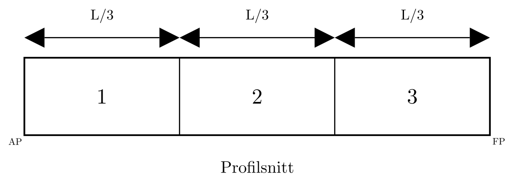

# Oppgaver i skadestabilitet (Tapt oppdrift-metoden)

## 1. Instruksjoner

- Løs hver oppgave med tydelige enheter og konsekvent fortegnskonvensjon.
- Vis mellomregningene, ikke bare sluttsvaret.
- Kontroller akseptkriteriene til slutt
- For oppgaver med skadelengde skal $T_S$ finnes fra
  $LBT = (L-l_d)BT_S$, samtidig som deplasementet bevares i denne metoden ($\nabla_S=\nabla$).

## 2. Oppgavesett A: Enkeltkonsepter

### A1. Likevekt ved symmetrisk skade

**Last ned øvingsnotatbok:** [Oppgave_A1.ipynb](exports/Oppgave_A1.ipynb)

- Oppgave:
  - Beregn ny likevektsdypgang ved symmetrisk fylling.
- Gitt:
  - Rektangulær lekter med $L = 50.0\ \mathrm{m}$, $B = 10.0\ \mathrm{m}$, $D = 5.0\ \mathrm{m}$
  - Initial dypgang $T = 2.80\ \mathrm{m}$
  - Lengde av skadet avdeling: $l_d = 2.0\ \mathrm{m}$
  - Anta fullstendig tap av oppdrift i avdelingen og parallell nedsynking i denne oppgaven
- Besvarelse:
  - Endelig dypgang
 
- Fasit:
  - $T_S = 2.9167\ \mathrm{m}$

### A2. Skadelengde og dypgang ved symmetrisk skade

**Last ned øvingsnotatbok:** [Oppgave_A2.ipynb](exports/Oppgave_A2.ipynb)

*Figur: Rektangulær lekter med 3 like store langskips avdelinger - den midtre avdelingen er skadet.*

- Oppgave:
  - En lekter er delt inn i 3 like store avdelinger langskips. Den midtre avdelingen er skadet.
- Gitt:
  - Rektangulær lekter med $L = 60.0\ \mathrm{m}$, $B = 12.0\ \mathrm{m}$, $D = 6.0\ \mathrm{m}$
  - Initial dypgang $T = 3.00\ \mathrm{m}$
  - 3 like store avdelinger, slik at $l_d = L/3$
- Besvarelse:
  - Skadelengde $l_d$
  - Symmetrisk skadet dypgang $T_S$
  - Sjekk om $T_S < D$
- Fasit:
  - Bruk den skjulte løsningen nedenfor til egenkontroll

### A3. Reduksjon i Vannlinjeareal og $BM$

**Last ned øvingsnotatbok:** [Oppgave_A3.ipynb](exports/Oppgave_A3.ipynb)

- Oppgave:
  - Beregn redusert vannlinjeareal etter skade.
  - Finn redusert vannlinjetreghetsmoment og oppdatert $BM_{T_S}$.
- Gitt:
  - Rektangulær lekter med $L=72.0\ \mathrm{m}$, $B=11.0\ \mathrm{m}$, $T=2.80\ \mathrm{m}$
  - Lengde av skadet avdeling $l_d=6.0\ \mathrm{m}$
  - Volumdeplasement for lekteren: $\nabla=LBT=2217.6\ \mathrm{m^3}$
  - Bruk formler for rektangulær lekter 
- Leveranse:
  - Vannlinjeareal før/etter skade
  - $I_{WL}$ før/etter skade
  - $BM_T$ før/etter skade
- Fasit:
  - Vannlinjeareal: $792\ \rightarrow\ 726\ \mathrm{m^2}$
  - $I_{WL}$: $7986.0\ \rightarrow\ 7320.5\ \mathrm{m^4}$
  - $BM_T$: $3.601\ \rightarrow\ 3.301\ \mathrm{m}$

### A4. Stabilitetskontroll etter skade

**Last ned øvingsnotatbok:** [Oppgave_A4.ipynb](exports/Oppgave_A4.ipynb)

- Oppgave:
  - Beregn oppdatert $KB_S$, $BM_{T_S}$ og $GM_S$ i skadet tilstand.
- Gitt:
  - Oppdriftssenter i skadet tilstand: $KB_S=1.62\ \mathrm{m}$
  - Tverrskips vannlinjetreghetsmoment i skadet tilstand: $I_{WL_S}=7600\ \mathrm{m^4}$
  - Volumdeplasement: $\nabla=2160\ \mathrm{m^3}$
  - Vertikalt tyngdepunkt: $KG=4.20\ \mathrm{m}$
- Leveranse:
  - Oppdaterte hydrostatiske data etter skade
  - Kort stabilitetstolkning
- Fasit:
  - $KB_S=1.62\ \mathrm{m}$, $BM_{T_S}=3.519\ \mathrm{m}$, $GM_S=0.939\ \mathrm{m}$
  - $GM_S>0\ \mathrm{m}$: gjenværende initial stabilitet er positiv

## 3. Oppgavesett B: Parameterstudie

### B1. Sensitivitetsstudie

**Last ned øvingsnotatbok:** [Oppgave_B1.ipynb](exports/Oppgave_B1.ipynb)

Et regnearkmal for oppgaven er tilgjengelig her: [B1\_sensitivitetsstudie\_mal.csv](exports/B1_sensitivitetsstudie_mal.csv)

- Oppgave:
  - Bruk tabellen nedenfor (eller last ned malen).
  - For hvert tilfelle beregnes $l_d=L/N$, deretter $T_S$, $BM_{T_S}$ og $GM_S$.
  - Sammenlign hvordan endringene i inndata påvirker $T_S$ og $GM_S$.
- Gitt:
  - Bruk $KG=4.20\ \mathrm{m}$ og $\rho=1.0\ \mathrm{t/m^3}$ for alle tilfeller.
  - Anta en skadet avdeling og bruk box-barge-tilnærminger.

| Tilfelle | $L$ (m) | $B$ (m) | $T$ (m) | Antall avdelinger $N$ | $l_d=L/N$ (m) | $T_S$ (m) | $BM_{T_S}$ (m) | $GM_S$ (m) |
|---|---:|---:|---:|---:|---:|---:|---:|---:|
| Basis | 60.0 | 12.0 | 3.00 | 5 |  |  |  |  |
| Færre avdelinger | 60.0 | 12.0 | 3.00 | 3 |  |  |  |  |
| Bredere lekter | 60.0 | 14.0 | 3.00 | 5 |  |  |  |  |
| Stor initial dypgang | 60.0 | 12.0 | 3.50 | 5 |  |  |  |  |

- Leveranse:
  - Utfylt tabell
  - Kort trenddiskusjon
- Fasit:
  - Fyll inn

## 4. Oppgavesett C: Trim

### C1. Trimmoment

**Last ned øvingsnotatbok:** [Oppgave_C1.ipynb](exports/Oppgave_C1.ipynb)

*Figur: Fem like store avdelinger; bruk denne inndelingen i oppgaven*

- Oppgave:
  - Bestem trimmomentet som oppstår når avdeling 4 (regnet fra AP) er skadet.
- Gitt:
  - Rektangulær lekter med $L=100.0\ \mathrm{m}$, $B=20.0\ \mathrm{m}$, $T=3.50\ \mathrm{m}$
  - 5 like store avdelinger langskips, slik at hver avdeling er $20.0\ \mathrm{m}$ lang
  - Avdeling 4 er skadet (fra $x=60$ til $x=80\ \mathrm{m}$)
  - Bruk $\rho=1.025\ \mathrm{t/m^3}$ og $LCG=50.0\ \mathrm{m}$ fra AP
  - I denne oppgaven brukes $LCB_S=45.0\ \mathrm{m}$ fra AP
- Leveranse:
  - Vektdeplasement $\Delta$
  - Trimarm $l_k=LCG-LCB_S$
  - Trimmoment $M_{trim}=\Delta\,l_k$
- Fasit:
  - Fyll inn

### C2. Trim fra gitt $M_{T}$ og $BM_{L_S}$

**Last ned øvingsnotatbok:** [Oppgave_C2.ipynb](exports/Oppgave_C2.ipynb)

- Oppgave:
  - Beregn enhetstrimmomentet $MCT_{1cm_S}$ og total trim.
- Gitt:
  - $\Delta=7175\ \mathrm{t}$
  - $L=100.0\ \mathrm{m}$
  - $BM_{L_S}=207.619\ \mathrm{m}$
  - $M_{T}=35{,}875\ \mathrm{t\,m}$
- Leveranse:
  - Enhetstrimmomentet $MCT_{1cm_S}$ i $\mathrm{t\,m/cm}$
  - Den totale trimmen $t$
- Fasit:
  - Fyll inn

### C3. Fordeling av total trim og endelig dypgang

**Last ned øvingsnotatbok:** [Oppgave_C3.ipynb](exports/Oppgave_C3.ipynb)

- Oppgave:
  - Fordel kjent trim i akterlig og forlig komponent og beregn endelige dypganger.
- Gitt:
  - $t=240.83\ \mathrm{cm}$
  - $LCF_S=45.0\ \mathrm{m}$ fra AP, $L=100.0\ \mathrm{m}$
  - Symmetrisk skadet dypgang før trim: $T_S=4.375\ \mathrm{m}$
- Leveranse:
  - $t_a$ og $t_f$
  - Endelige dypganger $T_A$ og $T_F$

- Fasit:
  - Fyll inn

## 5. Oppgavesett D: Fullstendig forløp ved skade

### D1. Full Skadet Likevekt Fra Start Til Slutt

**Last ned øvingsnotatbok:** [Oppgave_D1.ipynb](exports/Oppgave_D1.ipynb)

- Oppgave:
  - Lekteren skal beregnes fra initial tilstand til endelig akseptkontroll ved skade.
- Gitt:
  - Rektangulær lekter: $L = 60.0\ \mathrm{m}$, $B = 12.0\ \mathrm{m}$, $D = 6.0\ \mathrm{m}$
  - Initial dypgang: $T = 3.00\ \mathrm{m}$
  - Tyngdepunkt: $KG = 4.20\ \mathrm{m}$
  - Lengde av skadet avdeling: $l_d = 3.5\ \mathrm{m}$
  - Oppdaterte hydrostatiske verdier i skadet tilstand:
    - $KB_S = 1.62\ \mathrm{m}$
    - $I_{WL_S} = 7600\ \mathrm{m^4}$
    - $I_{F_S} = 2.10 \times 10^6\ \mathrm{m^4}$
    - $LCB_S = 29.75\ \mathrm{m}$ fra AP
    - $LCF_S = 30.00\ \mathrm{m}$ fra AP
    - $LCG = 30.00\ \mathrm{m}$ fra AP
  - Bruk $\rho = 1.0\ \mathrm{t/m^3}$
- Leveranse:
  - Endelige dypganger $T_A$ og $T_F$
  - Akseptkontroller ($GM_S > 0\ \mathrm{m}$, $\max(T_A,T_F) < D$)
- Fasit:
  - $T_S = 3.1858\ \mathrm{m}$, $T_A = 3.1781\ \mathrm{m}$, $T_F = 3.1935\ \mathrm{m}$, $GM_S = 0.939\ \mathrm{m}$, PASS

## 6. Oppgavesett E: Intakt tank med fri væskeoverflate vs skadet tank

**Last ned øvingsnotatbok:** [Oppgave_E1.ipynb](exports/Oppgave_E1.ipynb)

- Oppgave:
  - En lekter har en tank som går fra side til side og med lengde gitt under. Sammenlign:
    - korrigert $GM$ for fri væskeoverflate i slakk tank, og der tettheten til innholdet er det samme
    - $GM_S$ for skadet tank
- Gitt:
  - Samme lekter og samme geometriske forutsetninger
  - $L = 50.0\ \mathrm{m}$
  - $B = 10.0\ \mathrm{m}$
  - $T = 2.80\ \mathrm{m}$
  - $T_S = T$ 
  - $l_tank = 5.0\ \mathrm{m}$
  - $l_d = l_{tank}$
  - Anta $T_S = T$ (parallell nedsynking neglisjeres for sammenligningen)
- Leveranse:
  - Kort utledning eller forklaring
  - Kvantitativ sammenligning
  - Fysisk tolkning
- Fasit:
  - $\Delta GM_{FSE} = \Delta BM_T = 0.298\ \mathrm{m}$ - begge metoder gir identisk GM-reduksjon

## 7. Løsningsdel

### A1 Løsning

Gitt:
- $L = 50.0\ \mathrm{m}$
- $B = 10.0\ \mathrm{m}$
- $D = 5.0\ \mathrm{m}$
- $T = 2.80\ \mathrm{m}$
- $l_d = 2.0\ \mathrm{m}$

Løs direkte for skadet likevektsdypgang $T_S$:

$$
LBT = (L-l_d)BT_S
$$

$$
T_S = \frac{L}{L-l_d}T = \frac{50}{50-2.0}\cdot 2.80 = 2.9167\ \mathrm{m}
$$

Rask kontroll mot dybden:

$$
T_S = 2.9167\ \mathrm{m} < D = 5.0\ \mathrm{m}\ \Rightarrow\ \text{dypgangskrav oppfylt}
$$

### A2 Løsning

Vis løsning

Gitt:

- $L = 60.0\ \mathrm{m}$
- $B = 12.0\ \mathrm{m}$
- $D = 6.0\ \mathrm{m}$
- $T = 3.00\ \mathrm{m}$
- $l_d = L/3 = 20.0\ \mathrm{m}$

Løs for $T_S$:

$$
LBT = (L-l_d)BT_S
$$

$$
T_S = \frac{L}{L-l_d}T = \frac{60}{60-20}\cdot 3.00 = 4.50\ \mathrm{m}
$$

Kontroll mot dybden:

$$
T_S = 4.50\ \mathrm{m} < D = 6.0\ \mathrm{m}\ \Rightarrow\ \text{dypgangskrav oppfylt}
$$

### A3 Løsning

Bruk inndataene fra A2:

- $L=72.0\ \mathrm{m}$, $B=11.0\ \mathrm{m}$, $T=2.80\ \mathrm{m}$
- $l_d=6.0\ \mathrm{m}$
- $\nabla=LBT=72\cdot 11\cdot 2.8=2217.6\ \mathrm{m^3}$

Vannlinjeareal for og etter skade:

$$
A_{WL}=LB=72\cdot 11=792\ \mathrm{m^2}
$$

$$
A_{WL_S}=(L-l_d)B=(72-6)\cdot 11=726\ \mathrm{m^2}
$$

$$
\Delta A_{WL}=792-726=66\ \mathrm{m^2}
$$

Intakt tverrskips vannlinjetreghetsmoment for en box-barge-vannlinje:

$$
I_{WL}=\frac{LB^3}{12}=\frac{72\cdot 11^3}{12}=7986.0\ \mathrm{m^4}
$$

Skadet tverrskips vannlinjetreghetsmoment:

$$
I_{WL_S}=\frac{(L-l_d)B^3}{12}=\frac{66\cdot 11^3}{12}=7320.5\ \mathrm{m^4}
$$

Intakt og skadet tverrskips metasenterradius:

$$
BM_T=\frac{I_{WL}}{\nabla}=\frac{7986.0}{2217.6}=3.601\ \mathrm{m}
$$

$$
BM_{T_S}=\frac{I_{WL_S}}{\nabla}=\frac{7320.5}{2217.6}=3.301\ \mathrm{m}
$$

Reduksjon:

$$
\Delta I_{WL}=7986.0-7320.5=665.5\ \mathrm{m^4}
$$

$$
\Delta BM_T=3.601-3.301=0.300\ \mathrm{m}
$$

Fasit:

- Vannlinjeareal for/etter skade: $792\ \rightarrow\ 726\ \mathrm{m^2}$
- $I_{WL}$ for/etter skade: $7986.0\ \rightarrow\ 7320.5\ \mathrm{m^4}$
- $BM_T$ for/etter skade: $3.601\ \rightarrow\ 3.301\ \mathrm{m}$
- Tolkning: skadet vannlinje har lavere treghet, derfor avtar $BM_T$.

### A4 Løsning

Bruk skadet-tilstand-inndataene fra D1:

- $KB_S=1.62\ \mathrm{m}$
- $I_{WL_S}=7600\ \mathrm{m^4}$
- $\nabla=2160\ \mathrm{m^3}$
- $KG=4.20\ \mathrm{m}$

Beregn skadet tverrskips metasenterradius:

$$
BM_{T_S}=\frac{I_{WL_S}}{\nabla}=\frac{7600}{2160}=3.519\ \mathrm{m}
$$

Beregn deretter skadet metasentrisk høyde:

$$
GM_S=KB_S+BM_{T_S}-KG=1.62+3.519-4.20=0.939\ \mathrm{m}
$$

Fasit:

- $KB_S=1.62\ \mathrm{m}$
- $BM_{T_S}=3.519\ \mathrm{m}$
- $GM_S=0.939\ \mathrm{m}$
- Stabilitetstolkning: $GM_S>0$, slik at gjenværende initial tverrskips stabilitet fortsatt er positiv.

### B1 Løsning

Forutsetninger for en rask sensitivitetsstudie:

- En skadet avdeling, med like lange avdelinger: $l_d=L/N$
- Bare symmetrisk dypgang (ingen trim i denne oppgaven):
  $$T_S=\frac{L}{L-l_d}T$$
- Box-barge-tilnærming vertikalt: $KB_S\approx T_S/2$
- Tilnærmet skadet tverrskips vannlinjetreghet: $I_{WL_S}\approx (L-l_d)B^3/12$
- Bevart volumdeplasement i denne modellen: $\nabla=LBT$
- Sammenlign $GM_S$ med konstant $KG=4.20\ \mathrm{m}$:
  $$BM_{T_S}=\frac{I_{WL_S}}{\nabla},\qquad GM_S\approx KB_S+BM_{T_S}-KG$$

Eksempeloversikt:

| Tilfelle | $L$ (m) | $B$ (m) | $T$ (m) | $N$ | $l_d$ (m) | $T_S$ (m) | $BM_{T_S}$ (m) | $GM_S$ (m) |
|---|---:|---:|---:|---:|---:|---:|---:|---:|
| Basis | 60 | 12 | 3.0 | 5 | 12.0 | 3.750 | 3.200 | 0.875 |
| Færre avdelinger (stor skadelengde) | 60 | 12 | 3.0 | 3 | 20.0 | 4.500 | 2.667 | 0.717 |
| Bredere lekter | 60 | 14 | 3.0 | 5 | 12.0 | 3.750 | 4.356 | 2.031 |
| Stor initial dypgang | 60 | 12 | 3.5 | 5 | 12.0 | 4.375 | 2.743 | 0.731 |

Trendoppsummering:

- Stor skadelengde ($N$ mindre) gir større $T_S$ og vil ofte redusere $GM_S$.
- Økt bredde gir klart større $I_{WL_S}$ og $BM_{T_S}$, slik at $GM_S$ bedres.
- Større intakt dypgang gir høyere $KB_S$, men også større deplasement; i dette oppsettet kan nettoeffekten bli lavere $GM_S$.

### D1 Løsning

Steg 1: Initialt deplasement

$$
\nabla = LBT = 60 \cdot 12 \cdot 3.00 = 2160\ \mathrm{m^3}
$$

Med $\rho = 1.0\ \mathrm{t/m^3}$:

$$
\Delta = 2160\ \mathrm{t}
$$

Steg 2: Parallell nedsynking på grunn av tapt oppdrift

$$
LBT = (L-l_d)BT_S
$$

$$
T_S = \frac{L}{L-l_d}T = \frac{60}{60-3.5}\cdot 3.00 = 3.1858\ \mathrm{m}
$$

$$
\nabla_S = \nabla = 2160\ \mathrm{m^3}
$$

$$
\Delta_S = \Delta = 2160\ \mathrm{t}
$$

Steg 3: Oppdatert hydrostatikk

$$
BM_{T_S} = \frac{I_{WL_S}}{\nabla} = \frac{7600}{2160} = 3.519\ \mathrm{m}
$$

$$
BM_{L_S} = \frac{I_{F_S}}{\nabla} = \frac{2.10 \times 10^6}{2160} = 972.2\ \mathrm{m}
$$

$$
GM_S = KB_S + BM_{T_S} - KG = 1.62 + 3.519 - 4.20 = 0.939\ \mathrm{m}
$$

Steg 4: Trim og fordeling av dypgang

Med AP-baserte koordinater brukes $LCG = 30.00\ \mathrm{m}$ og $LCB_S = 29.75\ \mathrm{m}$:

$$
M_{trim} = \Delta \times (LCG - LCB_S) = 2160(30.00 - 29.75) = 540.0\ \mathrm{t\,m}
$$

Tilnærmet moment til trimendring på 1 cm:

$$
MCT_{1cm_S} = \frac{\Delta \times BM_{L_S}}{100 \times L} = \frac{2160 \cdot 972.2}{100 \cdot 60} = 350.0\ \mathrm{t\,m/cm}
$$

$$
trim = \frac{M_{trim}}{MCT_{1cm_S}} = \frac{540.0}{350.0} = 1.543\ \mathrm{cm} = 0.01543\ \mathrm{m}
$$

Med $LCF_S = 30.00\ \mathrm{m}$ fra AP (midskips), blir AP-baserte trimandeler like store:

$$
a_{akter}=\frac{LCF_S}{L}=0.50,\qquad a_{for}=\frac{L-LCF_S}{L}=0.50
$$

$$
t_a = trim\cdot a_{akter}=0.00771\ \mathrm{m},\qquad t_f = trim\cdot a_{for}=0.00771\ \mathrm{m}
$$

$$
T_F = T_S + t_f = 3.1935\ \mathrm{m}
$$

$$
T_A = T_S - t_a = 3.1781\ \mathrm{m}
$$

Steg 5: Akseptkontroller

$$
GM_S = 0.939\ \mathrm{m} > 0\ \mathrm{m}\ \Rightarrow\ \text{OK}
$$

$$
T_{crit} = \max(T_A, T_F) = 3.1935\ \mathrm{m} < D = 6.0\ \mathrm{m}\ \Rightarrow\ \text{OK}
$$

Sluttvurdering:

- Kravet til gjenværende stabilitet er oppfylt.
- Kravet til dypgang mot dybde er oppfylt.
- Beregnet symmetrisk skadet dypgang: $T_S = 3.1858\ \mathrm{m}$.
- Endelige skadede dypganger: $T_A = 3.1781\ \mathrm{m}$ og $T_F = 3.1935\ \mathrm{m}$.

### E1 Løsning

Bruk inndataene fra E1:

- $L = 50.0\ \mathrm{m}$, $B = 10.0\ \mathrm{m}$, $T = 2.80\ \mathrm{m}$
- $l_{tank} = l_d = 5.0\ \mathrm{m}$
- $\nabla = LBT = 50\cdot 10\cdot 2.80 = 1400\ \mathrm{m^3}$

**Metode 1 - Fri væskeoverflate-korreksjon (intakt slakk tank):**

Tverrskips treghetsmoment for tankens fri overflate:

$$
i_{tank} = \frac{l_{tank}\,B^3}{12} = \frac{5.0\cdot 10^3}{12} = 416.7\ \mathrm{m^4}
$$

Korreksjon (samme tetthet som sjøvann, $\rho_{content}=\rho$):

$$
\Delta GM_{FSE} = \frac{i_{tank}}{\nabla} = \frac{416.7}{1400} = 0.298\ \mathrm{m}
$$

**Metode 2 - Tapt oppdrift (skadet avdeling, $l_d = l_{tank}$):**

Reduksjon i tverrskips vannlinjetreghetsmoment:

$$
\Delta I_{WL} = \frac{l_d\,B^3}{12} = \frac{5.0\cdot 10^3}{12} = 416.7\ \mathrm{m^4}
$$

Tilsvarende reduksjon i tverrskips metasenterradius:

$$
\Delta BM_T = \frac{\Delta I_{WL}}{\nabla} = \frac{416.7}{1400} = 0.298\ \mathrm{m}
$$

**Sammenligning:**

$$
\Delta GM_{FSE} = \Delta BM_T = 0.298\ \mathrm{m}
$$

Resultatet er identisk fordi brøken $\frac{l\,B^3/12}{\nabla}$ er den samme i begge metoder når tanken og den skadede avdelingen har lik geometri og lik tetthet.

**Fysisk tolkning:**

- Begge korreksjonene stammer fra det samme matematiske uttrykket - tverrskips treghetsmoment delt på deplasementet.
- For den slakke tanken virker dette som en virtuell stigning av $G$ (frioverflateeffekt).
- For den skadede avdelingen er det en reell reduksjon i $BM_T$ (redusert vannlinjeareal).
- Gitt nøyaktig lik geometri og tetthet gir de to metodene identisk GM-tap.

