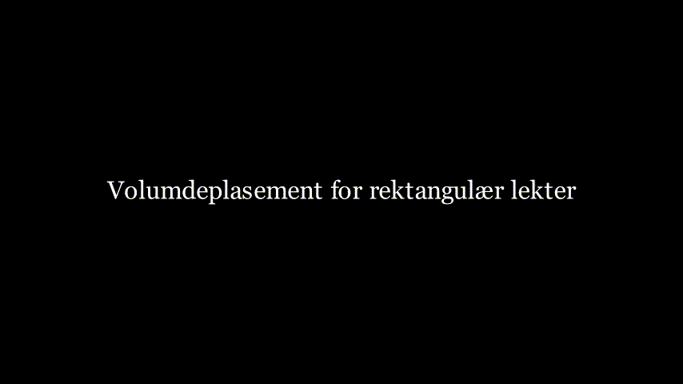
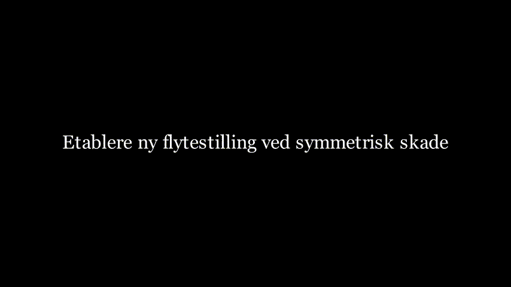
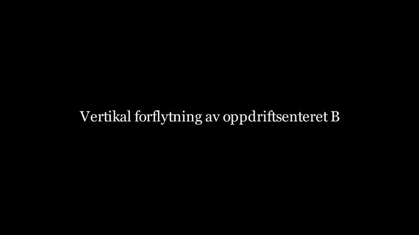
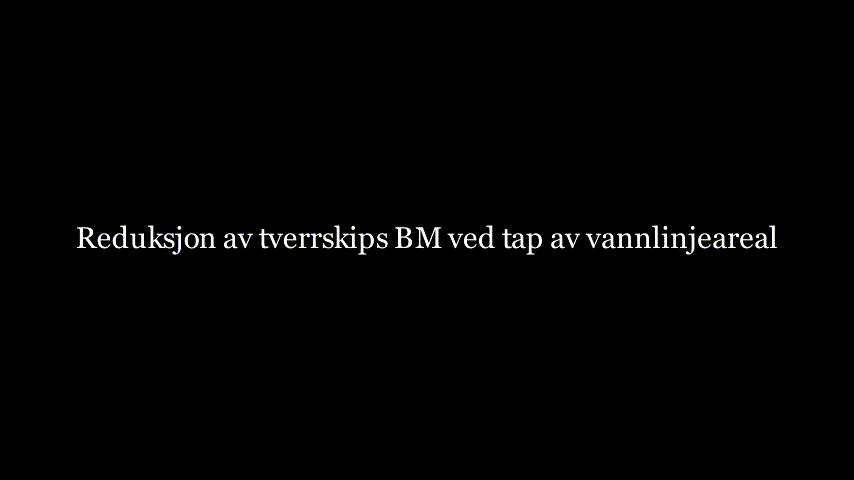
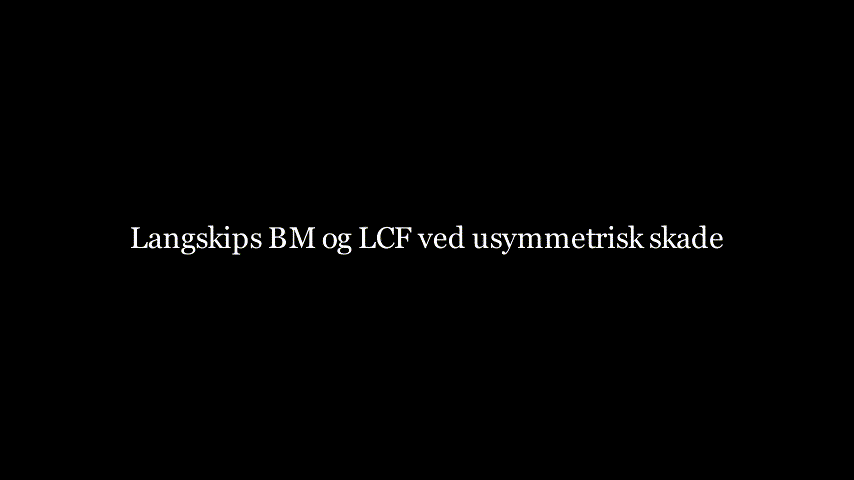
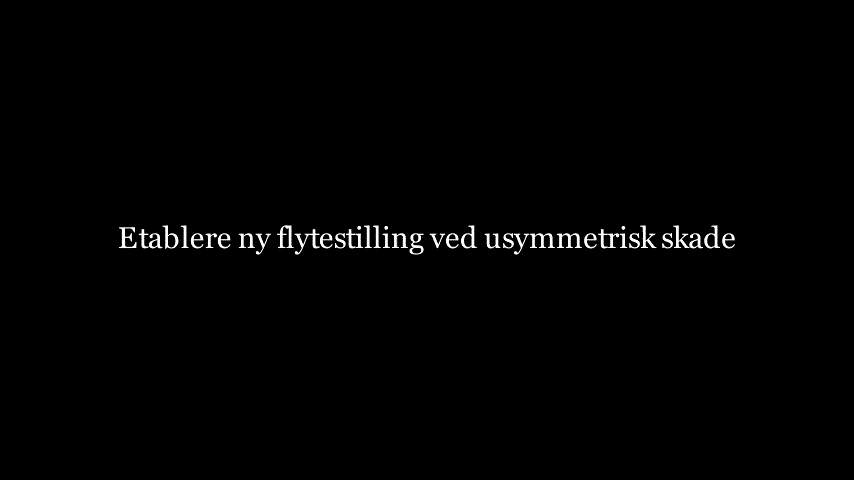
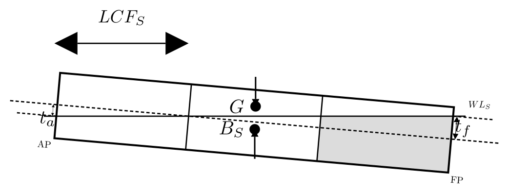

# Skadestabilitet teori (Tapt oppdrift-metoden)

## 1. Læringsmål

Etter denne modulen skal studenten kunne:

- Beskrive forutsetningene i tapt oppdrift-metoden.
- Beregne ny likevekt etter skade ved symmetrisk fylling.
- Beregne og evaluere hydrostatikken til en rektangulær lekter etter skade.
- Beregne trimvirkninger ved usymmetrisk skade og bestemme likevekt og dypgang forut og akter. 
- Vurdere akseptabel flytetilstand og stabilitet ved skade 

## 2. Forutsetninger, Symboler og Enheter

### 2.1 Forutsetninger

- Geometrien antas prismatisk (rektangulær lekter) dersom ikke annet er oppgitt.
- Det skadede avdelingmet antas helt åpent mot sjøen og bidrar ikke med oppdrift.
- vanninntregningen i skadet avdeling vil ha samme tetthet. 
- Statisk likevekt antas (ingen dynamiske fyllingseffekter).
- Små vinkel-antakelser for trim brukes.
- Fortegnskonvensjon:
  - Positiv dypgangsendring betyr større neddykking.
  - Positiv trim betyr forlig trim; $T_F > T_A$.
  - Alle mål er gitt fra aktre perpendikulær og baseline, med $x=0$ i AP og $x=L$ i FP.

### 2.2 Benevnelser 

| Symbol | Betydning | Enhet |
|---|---|---|
| $L$ | Lengde | m |
| $B$ | Bredde | m |
| $D$ | Dybde | m |
| $T$ | Intakt dypgang | m |
| $T_S$ | Symmetrisk skadet dypgang | m |
| $\nabla$ | Intakt volumdeplasement | m³ |
| $\nabla_S$ | Skadet volumdeplasement | m³ |
| $I_{WL}$ | Annet arealmoment for vannlinjearealet (intakt) | m⁴ |
| $I_{WL_S}$ | Annet arealmoment for vannlinjearealet (skadet) | m⁴ |
| $I_F$ | Annet arealmoment for vannlinjearealet om $LCF$ (intakt) | m⁴ |
| $I_{F_S}$ | Annet arealmoment for vannlinjearealet om $LCF$ (skadet) | m⁴ |
| $KB$ | Baseline til oppdriftssenter | m |
| $BM$ | Metasentrisk radius | m |
| $GM$ | Metasentrisk høyde | m |
| $LCB$ | Langskips oppdriftssenter | m |
| $LCF$ | Langskips flotasjonssenter | m |
| $t_a$ | Akterlig trimendring | m |
| $t_f$ | Forlig trimendring | m |
| $T_A$ | Dypgang ved AP | m |
| $T_F$ | Dypgang ved FP | m |

## 3. Framgangsmåte 

### 3.1 Oppsummering av geometri og hydrostatikk

*Animasjon: Oppbygging av lekterens hoveddimensjoner.*

Lekteren har i initial kondisjon (før skade) følgende opplysninger oppgitt:

- Hoveddimensjoner: $L$, $B$, $D$
- Intakt tilstand: $T$, $KG$
- Tetthet til vannet: $\rho$

*Animasjon: Intakt hydrostatikk - volumdeplasement*

- Volumdeplasement:

$
\nabla = L \times B \times T
$

- Vektdeplasement:

$
\Delta = \rho \times \nabla
$

- Vannlinjearealets "treghetsmoment":

$
BM_T = \frac{I_{WL}}{\nabla},\qquad BM_L = \frac{I_F}{\nabla}
$

Mini-sjekk:

- Hvis $L=60\ \mathrm{m}$, $B=12\ \mathrm{m}$, $T=3.0\ \mathrm{m}$, er $\nabla=2160\ \mathrm{m^3}$.

### 3.3 Parallell nedsynking

*Animasjon: Parallell nedsynking til skadet dypgang $T_S$.*

Denne fasen fastsetter ny symmetrisk skadet dypgang før eventuelle trimeffekter legges til.

For en rektangulær lekter med en skadet avdeling blir effektiv oppdriftsgivende lengde $(L-l_d)$. 

Volumdeplasementet forblir konstant i tapt oppdriftsmethoden:

$
L \times B \times T = (L-l_d) \times B \times T_S
$

Ligningen over løses med hensyn på $T_S$, og vi finner ny dypgang i skadet tilstand:

$
T_S = \frac{L}{L-l_d}T
$

Kontroller deretter: 

$
\nabla_S = \nabla
$

Eksempel: lekter med 3 like store avdelinger (midtre avdeling skadet)

- Gitt: $L=60\ \mathrm{m}$, $B=12\ \mathrm{m}$, $T=3.00\ \mathrm{m}$, 3 like avdelinger
- Lengde på skadet avdeling: $l_d=L/3=20\ \mathrm{m}$

$
T_S = \frac{L}{L-l_d}T = \frac{60}{60-20}\cdot 3.00 = 4.50\ \mathrm{m}
$

$
\nabla_S = \nabla = L \times B \times T = 60\cdot 12\cdot 3.00 = 2160\ \mathrm{m^3}
$

Kontroll:

- $T_S > T$ (som forventet etter skade).
- Flytekriteriet i dette eksempelet er oppfylt hvis $D > 4.50\ \mathrm{m}$.
    - Hva skjer om $T_S > D$ ? 

### 3.4 Endring av hydrostatikken ved skade 

Vi skal her se på hva som skjer med de hydrostatiske verdiene $KB$, $A_WL$ og $BM_T$ etter skade

#### 3.4.1 Vertikal forskyvning av oppdriftssenter $KB$ 

*Animasjon: Vertikal forskyvning av oppdriftssenteret - $KB_S$ etter skade.*

For en rektangulær lekter er oppdriftssenteret i skadet tilstand:

$
KB_S = \frac{T_S}{2}
$

#### 3.4.2 Reduksjon av vannlinjearealet, $ A_{WL}$ og metasenterradien $ BM_T $ 

*Animasjon: Reduksjon av tverrskips metasenterradius $BM_{T_S}$ på grunn av redusert vannlinjeareal.*

Skadet vannlinjeareal uttrykt ved skadet lengde $l_d$:

$
A_{WL_S} = (L-l_d)B
$

For en rektangulær vannlinje blir tilhørende annet arealmoment:

$
I_{WL_S} = \frac{(L-l_d)B^3}{12}
$

$
BM_{T_S} = \frac{I_{WL_S}}{\nabla},\qquad BM_{L_S} = \frac{I_{F_S}}{\nabla}
$

#### 3.5 Initialstabilitet ved skade $GM_S$

Basert på hydrostatikken i skadet tilstand beregnes ny GM: 
$
GM_S = KB_S + BM_{T_S} - KG
$

Mini-sjekk:

- Hvis $KB_S=1.62\ \mathrm{m}$, $I_{WL_S}=7600\ \mathrm{m^4}$, $\nabla=2160\ \mathrm{m^3}$ og $KG=4.20\ \mathrm{m}$, er $GM_S=0.939\ \mathrm{m}$.

### 3.6 Endring av hydrostatikken ved usymmetrisk skade
Vi skal her se på hva som skjer med de hydrostatiske verdiene $LCB$, $LCF$ og $BM_L$ ved usymmetrisk skade. Med usymmetrisk mener vi at avdelingen som fylles ikke ligger i senter. 

*Animasjon: Hydrostatikk ved usymmetrisk skade - endring av $LCB_S$, $LCF_S$ og $BM_{L_S}$.*

- $LCB_S$ i volumsenter av resterende intakte volumer i skadet tilstand.
- $LCF_S$ ligger i vannlinjearealets arealsenter i skadet tilstand. 

- Langskips metasenterradius om flotasjonssenter, $LCF_S$ i skadet tilstand:

$
BM_{L_S} = \frac{I_{F_S}}{\nabla}
$

### 3.7 Trimfordeling ($t_a$, $t_f$, $T_A$, $T_F$)

*Animasjon: Beregning av trimmoment og fordeling i trim $t_a$ (akter) og $t_f$ (for).*

#### 3.7.1 Trimmoment 

For å beregne den totale trimmen må vi se på trimmomentet forårsaket av $ LCG-LCB_S $

- Trimarm:

$
l_k = LCG-LCB_S
$

- Trimmoment:

$
M_{T} = \Delta \times l_k
$

#### 3.7.2 Total trimendring 

- Den totale trimendringen beregnes etter (husk denne kommer ut i cm, ikke m) 

$
t = \frac{M_{T}}{MCT_{1cm_S}}
$

- Og der momentet for å endre trim 1 cm:

$
MCT_{1cm_S} = \frac{\Delta \times BM_{L_S}}{100 \times L}
$

#### 3.7.3 Fordeling av trim om $LCF_S$

*Figur: Fordeling av total trim om $LCF_S$.*

$LCF_S$ er rotasjonsaksen som lekteren vil rotere om langskips, og vi får følgende forhold: 
$
	aft =\frac{LCF_S}{L},
\qquad
	fore =\frac{L-LCF_S}{L}
$

- Trimendring forut og akter: :

$
t_a = t\left(\frac{LCF_S}{L}\right),
\qquad
t_f = t\left(\frac{L-LCF_S}{L}\right)
$

- Spesialtilfelle (hvis $LCF_S=L/2$, dvs. midskips):

$
t_a = \frac{t}{2},\qquad t_f = \frac{t}{2}
$

- Endelige dypganger forut og akter: 

$
T_A= T_S - \frac{t_a}{100},\qquad T_F= T_S + \frac{t_f}{100}
$

$t_a$ og $t_f$ er her uttrykt i $cm$, og deles derfor på $100$ for å få endelig dypgang uttryk i $m$.

MERK: Hvis trimmomentet er mot klokken, reverseres fortegnene i likningene under.

### 3.8 Kontroll av dypgang og stabilitet ved usymmetrisk skade

$
GM_S > 0\ \mathrm{m}
$

- Kritisk dypgang:

$
T_{crit}=\max(T_A,T_F) < D
$

Konklusjon:

- Hvis begge kriteriene er oppfylt, vil fartøyet verken synke eller kantre i skadetilstanden.

## 4. Fullstendig Regneeksempel (fra start til slutt)

### 4.1 Gitte Data

- Fartøy (rektangulær lekter):
  - $L = 60.0\ \mathrm{m}$
  - $B = 12.0\ \mathrm{m}$
  - $D = 6.0\ \mathrm{m}$
  - Initial middeldypgang $T = 3.00\ \mathrm{m}$
  - Vertikalt tyngdepunkt $KG = 4.20\ \mathrm{m}$
  - Tilnærmet sjøvannstetthet: $\rho = 1.0\ \mathrm{t/m^3}$
- Skadetilfelle:
  - Lengde på skadet avdeling $l_d = 3.5\ \mathrm{m}$
  - Langskips oppdriftssenter etter skade: $LCB_S = 29.75\ \mathrm{m}$ fra AP
  - Langskips flotasjonssenter etter skade: $LCF_S = 30.00\ \mathrm{m}$ fra AP
- Oppdaterte hydrostatiske inndata fra geometrimodellen etter skade:
  - $KB_S = 1.62\ \mathrm{m}$
  - $I_{WL_S} = 7600\ \mathrm{m^4}$
  - $I_{F_S} = 2.10 \times 10^6\ \mathrm{m^4}$

### 4.2 Løsningssteg

Steg 1: Initialt deplasement og oppsett

$
\nabla = L \times B \times T = 60 \cdot 12 \cdot 3.00 = 2160\ \mathrm{m^3}
$

Med $\rho = 1.0\ \mathrm{t/m^3}$ er initialt deplasement $\Delta = 2160\ \mathrm{t}$.

Steg 2: Parallell nedsynking løst fra avdelingslengden

For en rektangulær lekter med en fullt skadet langskips avdeling er oppdriftsgivende lengde $(L-l_d)$. Likevekt gir:

$
L \times B \times T = (L-l_d) \times B \times T_S
$

$
T_S = \frac{L}{L-l_d}T = \frac{60}{60-3.5}\cdot 3.00 = 3.1858\ \mathrm{m}
$

Anvend bevaring av deplasement for dette oppsettet med tapt oppdrift:

$
\nabla_S = \nabla = 2160\ \mathrm{m^3}
$

Dermed forblir deplasementet:

$
\Delta_S = \Delta = 2160\ \mathrm{t}
$

Steg 3: Oppdatert hydrostatikk ($BM_{T_S}$, $BM_{L_S}$, $GM_S$)

$
BM_{T_S} = \frac{I_{WL_S}}{\nabla} = \frac{7600}{2160} = 3.519\ \mathrm{m}
$

$
BM_{L_S} = \frac{I_{F_S}}{\nabla} = \frac{2.10 \times 10^6}{2160} = 972.2\ \mathrm{m}
$

$
GM_S = KB_S + BM_{T_S} - KG = 1.62 + 3.519 - 4.20 = 0.939\ \mathrm{m}
$

Steg 4: Trim og endelige dypganger

Bruk AP-baserte koordinater med $LCG = 30.00\ \mathrm{m}$ og $LCB_S = 29.75\ \mathrm{m}$:

$
M_{trim} = \Delta \times (LCG - LCB_S) = 2160\,(30.00 - 29.75) = 540.0\ \mathrm{t\,m}
$

Bruk en box-barge-tilnærming for moment til å endre trim 1 cm:

$
MCT_{1cm_S} = \frac{\Delta \times BM_{L_S}}{100 \times L} = \frac{2160 \cdot 972.2}{100 \cdot 60} = 350.0\ \mathrm{t\,m/cm}
$

$
trim = \frac{M_{trim}}{MCT_{1cm_S}} = \frac{540.0}{350.0} = 1.543\ \mathrm{cm} = 0.01543\ \mathrm{m}
$

Anta trim om $LCF_S = 30.00\ \mathrm{m}$ fra AP (midskips i dette tilfellet), slik at trimkomponentene $t_a$ og $t_f$ hver blir halvparten av total trim:

$
t_a = \frac{trim_m}{2} = 0.00771\ \mathrm{m},\qquad t_f = \frac{trim_m}{2} = 0.00771\ \mathrm{m}
$

Endelige dypganger:

$
T_F = T_S + t_f = 3.1858 + 0.00771 = 3.1935\ \mathrm{m}
$

$
T_A = T_S - t_a = 3.1858 - 0.00771 = 3.1781\ \mathrm{m}
$

Steg 5: Akseptkontroll

- Reststabilitet:

$
GM_S = 0.939\ \mathrm{m} > 0\ \mathrm{m}\ \checkmark
$

- Kontroll av dypgang mot dybde (bruk største dypgang i dette enkle tilfellet):

$
T_{S,\max} \approx T_F = 3.1935\ \mathrm{m} < D = 6.0\ \mathrm{m}\ \checkmark
$

### 4.3 Endelige resultater

| Størrelse | Verdi | Enhet |
|---|---:|---|
| Initialt deplasementsvolum $\nabla$ | 2160 | m^3 |
| Lengde på skadet avdeling $l_d$ | 3.5 | m |
| Beregnet symmetrisk dypgang $T_S$ | 3.1858 | m |
| Skadet deplasementsvolum $\nabla_S$ | 2160 | m^3 |
| $BM_{T_S}$ | 3.519 | m |
| $GM_S$ | 0.939 | m |
| Total trim | 0.0154 | m |
| Dypgang ved AP $T_A$ | 3.1781 | m |
| Dypgang ved FP $T_F$ | 3.1935 | m |
| Akseptstatus | PASS | - |

Merk:
- Dette regneeksemplet er bevisst enkelt og bruker box-barge-tilnærminger for å tydeliggjøre framgangsmåten.
- I praktiske beregninger må forenklede uttrykk erstattes med hydrostatiske modellresultater for hver mellomliggende dypgang.

## 5. Fullstendig Regneeksempel: 5 like avdelinger, avdeling 4 skadet

### 5.1 Usymmetrisk fylling

Obligatorisk oppgave (separate filer):

- Oppgavetekst: [skadestabilitet_obligatorisk_oppgave.md](skadestabilitet_obligatorisk_oppgave.md)
- Løsningsforslag: [skadestabilitet_obligatorisk_oppgave_losning.md](skadestabilitet_obligatorisk_oppgave_losning.md)

Gitt:

- Lekterdimensjoner: $L=100.0\ \mathrm{m}$, $B=20.0\ \mathrm{m}$, $D=12.0\ \mathrm{m}$
- Initial dypgang: $T=3.50\ \mathrm{m}$
- 5 like store langskips avdelinger, slik at hver avdeling har lengde $L/5=20.0\ \mathrm{m}$
- Skadet avdeling: nr. 4 (fra AP), som strekker seg fra $x=60$ til $x=80\ \mathrm{m}$
- I dette regneeksemplet brukes $\rho=1.025\ \mathrm{t/m^3}$ (sjøvann), og vi antar $LCG=50.0\ \mathrm{m}$ (midskips)
- Box-barge-tilnærming vertikalt i skadet likevekt: $KB_S \approx T_S/2$

*Figur: Fem like store vanntette langskips avdelinger, der én avdeling er skadet i regneeksemplet.*

Steg 1: Initialt deplasement

$
\nabla = L \times B \times T = 100 \cdot 20 \cdot 3.50 = 7000\ \mathrm{m^3}
$

$
\Delta = \rho \times \nabla = 1.025\times 7000 = 7175\ \mathrm{t}
$

Steg 2: Symmetrisk skadet dypgang fra tapt oppdriftsgivende lengde

Lengde på skadet avdeling:

$
l_d = 20.0\ \mathrm{m},\qquad L_S=L-l_d=80.0\ \mathrm{m}
$

Løs likevekt:

$
L \times B \times T = (L-l_d) \times B \times T_S
$

$
T_S = \frac{L}{L-l_d}T = \frac{100}{80}\cdot 3.50 = 4.375\ \mathrm{m}
$

Bevaring av deplasement:

$
\nabla_S = \nabla = 7000\ \mathrm{m^3},\qquad \Delta_S = \Delta = 7175\ \mathrm{t}
$

Steg 3: Hydrostatiske inndata i skadet tilstand fra avdelingsgeometrien

Gjenværende oppdrifts- og vannplanområder er intervallene $[0,60]$ og $[80,100]$ m fra AP.

Langskips tyngdepunkter:

$
LCB_S = LCF_S = \frac{60\cdot 30 + 20\cdot 90}{60+20} = 45.0\ \mathrm{m}
$

Skadet annet arealmoment for vannlinjearealet om tverrakse:

$
I_{WL_S}=\frac{1}{12}(80)B^3 = \frac{1}{12}(80)(20^3)=53{,}333.3\ \mathrm{m^4}
$

Skadet annet arealmoment for vannlinjearealet om $LCF_S$:

$
I_{F_S}=\left[\frac{B\,60^3}{12}+A_1(30-45)^2\right]+\left[\frac{B\,20^3}{12}+A_2(90-45)^2\right]
$

med $A_1=60\cdot 20=1200\ \mathrm{m^2}$ og $A_2=20\cdot 20=400\ \mathrm{m^2}$, som gir

$
I_{F_S}=1{,}453{,}333.3\ \mathrm{m^4}
$

Bruk $KB_S \approx T_S/2 = 2.1875\ \mathrm{m}$.

Steg 4: Oppdaterte stabilitetsstørrelser

$
BM_{T_S}=\frac{I_{WL_S}}{\nabla}=\frac{53{,}333.3}{7000}=7.619\ \mathrm{m}
$

$
BM_{L_S}=\frac{I_{F_S}}{\nabla}=\frac{1{,}453{,}333.3}{7000}=207.619\ \mathrm{m}
$

$
GM_S=KB_S+BM_{T_S}-KG=2.1875+7.619-4.20=5.607\ \mathrm{m}
$

Steg 5: Trim og endelige dypganger

$
M_{trim}=\Delta \times (LCG-LCB_S)=7175\times(50.0-45.0)=35{,}875\ \mathrm{t\,m}
$

$
MCT_{1cm_S}=\frac{\Delta \times BM_{L_S}}{100\times L}=\frac{7175\times 207.619}{100\times 100}=148.967\ \mathrm{t\,m/cm}
$

$
trim_{cm}=\frac{M_{trim}}{MCT_{1cm_S}}=240.83\ \mathrm{cm},\qquad trim_m=2.4083\ \mathrm{m}
$

Beregne trimkomponentene $t_a$ og $t_f$ ved bruk av AP-baserte fordelingsfaktorer ($LCF_S=45.0\ \mathrm{m}$):

$
a_{akter}=\frac{LCF_S}{L}=0.45,\qquad a_{for}=\frac{L-LCF_S}{L}=0.55
$

$
t_a=trim_m\left(\frac{LCF_S}{L}\right)=2.4083\times 0.45=1.084\ \mathrm{m}
$

$
t_f=trim_m\left(\frac{L-LCF_S}{L}\right)=2.4083\times 0.55=1.3246\ \mathrm{m}
$

Endelige dypganger:

$
T_A=T_S-t_a=4.375-1.084=3.291\ \mathrm{m}
$

$
T_F=T_S+t_f=4.375+1.3246=5.700\ \mathrm{m}
$

Steg 6: Akseptkontroll

$
GM_S=5.607\ \mathrm{m}>0\ \mathrm{m}\ \checkmark
$

$
T_{crit}=\max(T_A,T_F)=5.700\ \mathrm{m}<D=12.0\ \mathrm{m}\ \checkmark
$

### 5.2 Endelige Resultater (ekstra eksempel)

| Størrelse | Verdi | Enhet |
|---|---:|---|
| Initialt deplasementsvolum $\nabla$ | 7000 | m^3 |
| Lengde på skadet avdeling $l_d$ | 20.0 | m |
| Beregnet symmetrisk dypgang $T_S$ | 4.375 | m |
| $LCB_S=LCF_S$ | 45.0 | m fra AP |
| $I_{WL_S}$ | 53,333.3 | m^4 |
| $I_{F_S}$ | 1,453,333.3 | m^4 |
| $BM_{T_S}$ | 7.619 | m |
| $GM_S$ | 5.607 | m |
| Total trim | 2.408 | m |
| Dypgang ved AP $T_A$ | 3.291 | m |
| Dypgang ved FP $T_F$ | 5.700 | m |
| Akseptstatus | PASS | - |

## 6. Vanlige feil og Rimelighetskontroller

Vanlige feil:

- Å blande enheter mellom $\mathrm{m}$, $\mathrm{m^2}$, $\mathrm{m^3}$ og tonn.
- Å la deplasementet endre seg etter skade ved bruk av tapt oppdriftsmetoden
- Å forveksle tverrskips og langskips vannlinjetreghetsmomenter ($I_{WL_S}$ og $I_{F_S}$).
- Å skifte fortegnskonvensjon for trim underveis i beregningen.
- Å kontrollere bare middel dypgang, i stedet for kritisk dypgang $\max(T_A,T_F)$.

Rimelighetskontroller før svaret godkjennes:

- $T_S$ bør normalt være større enn $T$ når et oppdriftsgivende volum går tapt.
- Kontroller at deplasementet faktisk er bevart i oppsettet: $\nabla_S=\nabla$ og $\Delta_S=\Delta$.
- $GM_S$ vil i de fleste skadetilfeller være lavere enn i intakt tilstand.
- Fortegnet på trimmen bør stemme med plasseringen av $LCG$ relativt til $LCB_S$.

## 7. Kort sjekkliste

1. Samle inndata: $L$, $B$, $D$, $T$, $KG$, $LCG$, $l_d$, samt skadede hydrostatiske størrelser eller geometridata som trengs for å finne $KB_S$, $LCB_S$, $LCF_S$, $I_{WL_S}$ og $I_{F_S}$.
2. Finn symmetrisk skadet dypgang fra tapt oppdriftsgivende lengde:

$
T_S = \frac{L}{L-l_d}T
$

3. Sett likevekten i skadet tilstand ved bevart deplasement:

$
\nabla_S=\nabla,\quad \Delta_S=\Delta
$

4. Beregn oppdaterte hydrostatiske størrelser:

$
BM_{T_S}=\frac{I_{WL_S}}{\nabla},\quad BM_{L_S}=\frac{I_{F_S}}{\nabla},\quad GM_S=KB_S+BM_{T_S}-KG
$

5. Beregn trimmomentet og total trim:

$
M_{trim}=\Delta \times (LCG-LCB_S),\quad MCT_{1cm_S}=\frac{\Delta \times BM_{L_S}}{100 \times L},\quad trim_{cm}=\frac{M_{trim}}{MCT_{1cm_S}}
$

6. Fordel trimmen om $LCF_S$ for å finne trimkomponentene $t_a$ og $t_f$.
7. Beregn endelige dypganger:

$
T_A=T_S-t_a,\quad T_F=T_S+t_f
$

8. Utfør akseptkontroll: $GM_S>0$ og $\max(T_A,T_F)<D$.

## 8. Referanser

TBC

